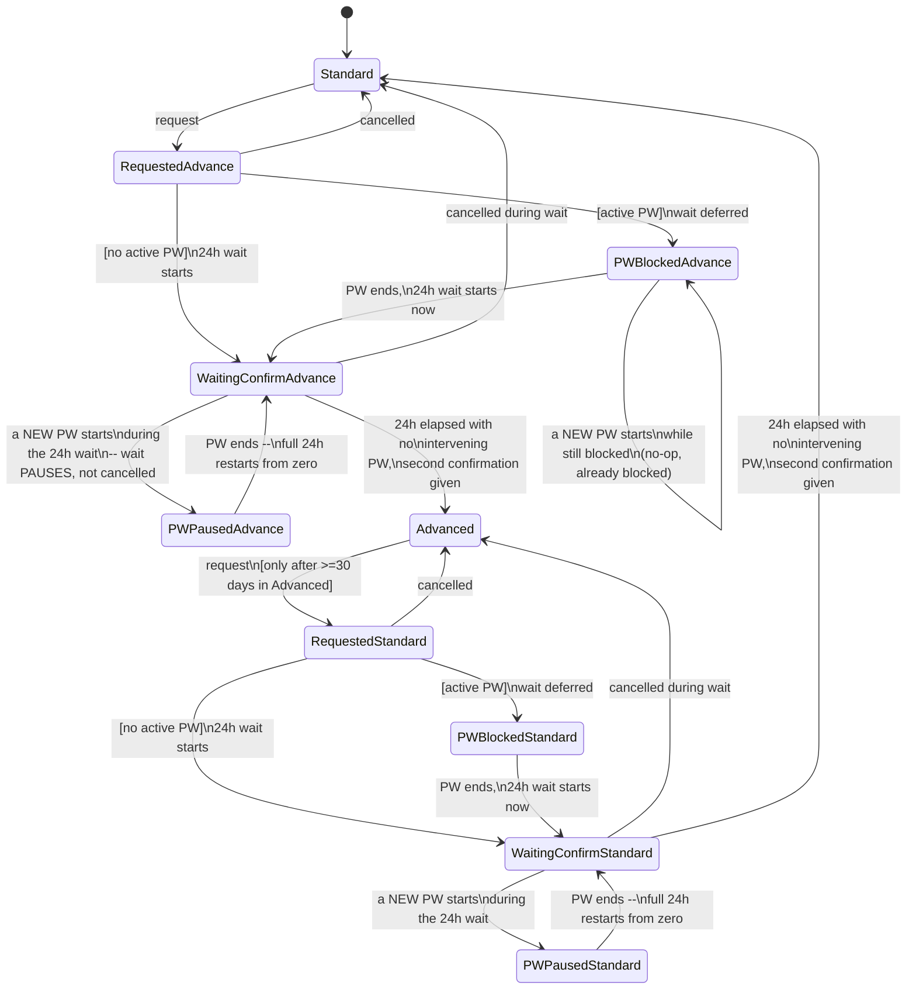

# Advanced Mode — Technical Design (v1.0)

> **Status: Draft for review, not approved for implementation.**
>
> Advanced Mode is a second, whole-platform **operating mode** — not a
> feature flag, not a handful of scattered `if advanced_mode` checks.
> Standard and Advanced use the same AI, the same long-term memory, the
> same journal, the same context understanding, and the same
> relationship shaped by whichever personality was chosen. The only
> difference is the scope of authority delegated to the AI and the
> strictness of the deterministic core's own rules. Section 2 states
> this as an explicit, permanent invariant.
>
> Depends on: `philosophy.md` (Hidden Token Economy, `critical_change`
> governance), `penalty_window_technical_design.md`
> (`MAX_TARGET_ACTIVE_HOURS`, Recovery Credit capacity),
> `activity_authorization_technical_design.md` (Token Ledger,
> `partnered_intimacy` policy), `hygiene_privilege_technical_design.md`
> (the `min()` cap algorithm this document only supplies new values
> for — see Section 8), and `task_catalog_technical_design.md` (a
> **proposed**, not-yet-implemented dependency — this document may
> reference it, but must never assume it exists in code).

## 1. The Question This Document Answers

Every canonical document in this project answers a narrow question
about one deterministic mechanism. This document is different in
kind: it answers **what changes, platform-wide, when a user delegates
more operational authority to the AI in exchange for stricter rules**
— and, equally importantly, exactly what does *not* change, so that
"Advanced" is never mistaken for "a better AI" or "a deeper
relationship."

## 2. `OperatingMode` — What It Changes, and the Permanent Invariant of What It Never Touches

> **Implemented, as a global singleton — see `advanced_mode/README.md`
> for the exact boundary.** This document's own global status remains
> unchanged (`Draft for review, not approved for implementation`);
> only this section's core concept and Section 11's transition state
> machine have been implemented, not the document as a whole.

```python
class OperatingMode(StrEnum):
    STANDARD = "standard"
    ADVANCED = "advanced"
```

**ADV-1 (permanent, non-negotiable):** `OperatingMode` never changes:
long-term memory, intelligence, the journal, planning capability,
relationship quality, personality, or the ability to understand
context. These are identical in both modes. `OperatingMode` changes
exactly two things: the scope of authority delegated to the AI
(Section 3) and the strictness of deterministic rules (Sections 6-9).

**ADV-2:** `OperatingMode` is a property of the user, stored
independently of `DelegatedAuthorityPolicy` (Section 3) and
`CommunicationProfile` (owned entirely by `ai_identity_technical_design.md`
— this document never reads, writes, or duplicates it; see Section 12).

## 3. `DelegatedAuthorityPolicy` — Authority Matrix

Named `DelegatedAuthorityPolicy`, not `AuthorityProfile` — deliberately
avoiding "Profile," which is `CommunicationProfile`'s own word, to keep
the two concepts from blurring together even in casual reference.

| Area | Standard | Advanced |
|---|---|---|
| Task assignment | AI proposes, user confirms | AI assigns autonomously within pre-approved bounds |
| Task time window | by agreement | AI determines |
| Difficulty | by agreement | AI selects within an approved range |
| Verification method | by agreement | AI selects |
| Follow-on tasks | require confirmation | AI assigns without further confirmation |
| Recovery Task selection | AI proposes, user approves | AI selects autonomously |
| Picture Verification | policy-configurable (future) | always `Allowed`, cannot be disabled by the user (Section 7) |
| Rules, parameters, authority scope, Trust algorithm, hygiene policy, permitted categories/equipment | AI may never change, in either mode | identical restriction |
| Objective obstacles (Section 4) | always respected | identical, always respected |

**ADV-3:** The bottom two rows are identical across both modes by
design — Advanced Mode expands *operational* authority, never
*structural* authority over its own rules. The AI may never, in either
mode: change its own scope of authority, change mode rules, change the
token economy (Section 7), change the maximum Penalty Window (Section
8), change the Trust algorithm, change hygiene policy, expand permitted
categories or equipment, bypass a user-set boundary, or self-approve a
significant system change it was not specifically delegated.

## 4. Objective Unavailability

**ADV-4:** The AI has more operational authority, but never ignores an
objective obstacle and never knowingly assigns an impossible task.
Recognized obstacles include: school, work, driving, sleep, a medical
appointment, a family event, lack of privacy, unavailable equipment,
illness, a health limitation, or another genuine objective obstacle.

**ADV-5 (confirmed, Section 9 of the governing discussion):**
`ObjectiveUnavailability` is **not** an Incident, **not** Trust
Evidence, and never automatically treated as suspicion — it is
primarily planning information. A task facing it is deferred,
rescheduled, or replaced with a compatible alternative. Only separate,
independent evidence of deliberate abuse of this mechanism may ever
affect Trust — never the mere fact, or frequency, of a claimed
obstacle by itself. Must be clearly distinguished from a legitimate
rescheduling request and from ordinary subjective reluctance — the
distinction is a Task Catalog / task-instance-owner concern (which
category a given claim falls into), not something this document
resolves on its own.

## 5. Equipment Inventory and Task Selection

**ADV-6:** Before autonomously assigning a task, Advanced Mode must
know real equipment state — not a binary yes/no. States: `available`,
`temporarily_unavailable`, `broken`, `loaned`, `user_currently_does_not_wish_to_use`,
`not_owned`. The AI never assumes ownership of equipment it hasn't been
told about. A task's `required_equipment`/`required_privacy`/
`required_context` (owned by Task Catalog, per its own document) must
all be satisfiable before a task may be selected — this document does
not own equipment inventory storage itself; that is a genuinely open
question (Section 17).

## 6. Picture Verification

**ADV-7:** In Advanced Mode, Picture Verification is always `Allowed`
as a *possible* verification method — the user cannot disable this
property of the mode. This does **not** mean photos are always
required; it means the AI may select photographic verification when it
fits the task type, without that option being closed off by user
configuration the way it may be in Standard (where it can be a
configurable future policy).

## 7. Token Economy — The Narrow, Explicit Exception to Hidden Token Economy

**ADV-8 (the resolved conflict — see the governing discussion's own
analysis of why this is a boundary refinement, not an abandonment):**
`philosophy.md` 4.2's Hidden Token Economy remains fully in force.
**Remains hidden:** current balance, exactly when tokens were earned,
exactly how much a specific action added, and ordinary release
decisions. **Becomes transparent, and only this:**

| Property | Standard | Advanced |
|---|---|---|
| Maximum tokens earnable per week | up to 2 | up to 1 |
| Guaranteed Partnered Release price | 2 tokens | 3 tokens |
| Maximum token debt (this release only) | 2 tokens | 3 tokens |

This transparency is limited to the Guaranteed-class price of one
specific, already-Guaranteed activity
(`relationship_decision_engine_technical_design.md`'s own Entitlement
Class model — Guaranteed means *"AI may not arbitrarily refuse, can
only apply pre-set rules"*; a pre-set rule is, by definition, something
that can be told to the person it binds). It does not reintroduce a
visible, user-spendable balance for anything else.

**ADV-9:** Partnered Release is not a Recovery Task, not a reward, and
not a means of pressure. It does not automatically end a Penalty
Window. It may use the existing Freeze mechanism
(`penalty_window_technical_design.md`).

**Open, not blocking (flagged, not resolved):** repeated exposure to
"this release created debt / did not create debt" could let a user
infer an approximate balance indirectly over time. This does not
violate the stated rule (the goal was never to prevent all inference,
only to prevent optimizing against a precisely known numeric state —
confirmed in the governing discussion) but is worth remaining aware of.

## 8. Maximum Penalty Window and Hygiene Caps

**ADV-10:** `MAX_TARGET_ACTIVE_HOURS` (`penalty_engine`, today a fixed
336-hour/14-day constant, "given explicitly by the architecture," not
`BOOTSTRAP_DEFAULT`) becomes a function of `OperatingMode`:

| Mode | Maximum PW |
|---|---|
| Standard | 336 hours (14 days) — unchanged |
| Advanced | 720 hours (30 days) |

This is an algorithm change to `penalty_engine/window.py`'s
`target_active_hours()`, not merely a new policy value (confirmed in
the governing discussion).

**Hygiene caps — this document supplies values only; the algorithm
stays where it already lives.**

**ADV-11:** The `min(trust_count, penalty_cap_count)` /
`min(trust_duration, penalty_cap_duration)` mechanism (Variant B,
confirmed) belongs to `hygiene_privilege_technical_design.md`, not
here — it is a core hygiene-algorithm change, applicable to every mode
uniformly, not an Advanced-Mode-specific concept. This document owns
only the Advanced-specific values below.

*Advanced Hygiene Trust values:*

| Trust Level | Advanced |
|---|---|
| LEVEL_1 | 2x/week, 15 min |
| LEVEL_2 | 3x/week, 20 min |
| LEVEL_3 | 4x/week, 20 min |
| LEVEL_4 | 5x/week, 20 min |

*Advanced Penalty Window caps:*

| PW Situation | Cap |
|---|---|
| Unrelated PW | 3x/week, 20 min |
| Hygiene-specific PW (default) | 2x/week, 15 min |
| Hygiene-specific PW (escalated -- the former "Level 0") | 1x/week, 15 min |

*Resulting effective table (`min()` applied):*

| Trust | No PW | Unrelated | Hygiene (default) | Hygiene (escalated) |
|---|---|---|---|---|
| L1 | 2x15 | 2x15 | 2x15 | 1x15 |
| L2 | 3x20 | 3x20 | 2x15 | 1x15 |
| L3 | 4x20 | 3x20 | 2x15 | 1x15 |
| L4 | 5x20 | 3x20 | 2x15 | 1x15 |

**ADV-12 (the new invariant explicitly requested):** Activation of a
Penalty Window must never increase either the count or the duration of
Discretionary Hygiene Breaks available, in either mode. Since
`effective = min(trust, penalty_cap)`, this holds automatically as long
as every `penalty_cap` row is less than or equal to its corresponding
`trust` row for the same Trust Level -- a constraint the numbers above
satisfy by construction, and one any future edit to either table must
preserve.

## 9. Consequences and `ConsequenceTask`

**ADV-13 (confirmed):** `Consequence` is a domain effect, not
automatically a task. Recognized forms include: extending a Penalty
Window (already `Extension`, existing), restricting authority,
downgrading available policy, creating an obligation, or -- only
sometimes -- assigning genuinely new activity. Only the last of these
is ever a `ConsequenceTask`. The first four are not task instances at
all and need no owner beyond whichever existing mechanism already
produces them (`Extension` already exists; the others are not designed
here).

**ADV-14:** `ConsequenceTask`'s runtime owner is explicitly left open.
It is **not** assigned to Penalty Engine by default -- Penalty Engine's
current responsibility (Penalty Windows, Extensions, Freezes, and
related deterministic restrictions) does not automatically extend to
owning task lifecycle merely because a task originated as a
consequence. No new module is created for it now. This waits for a
first concrete use case and a real lifecycle, the same discipline
applied to every other undecided task role (Section 12,
`task_catalog_technical_design.md` Section 9).

## 10. Task Runtime -- Not Built, Conditions for Reconsidering

**ADV-15:** No shared `Task Runtime`/generic task-management module is
introduced by this document. The only concrete implementation today
(`RecoveryTask`) has lifecycle semantics (`EXPIRED`, `WITHDRAWN`)
meaningfully coupled to `RecoveryPlan`'s own regeneration mechanics --
not evidence of a generalizable pattern yet. Conditions under which
extraction would become worth reconsidering, all four required
together:

1. At least two real (not merely designed) task-instance
   implementations exist.
2. At least one is not a Recovery Task.
3. They share genuinely identical lifecycle semantics, not merely
   similarly-named fields.
4. Visible code duplication, or a real cross-role need for a unified
   view, actually exists.

**ADV-16:** A cross-role need (e.g. Advanced Mode wanting "how many
tasks are currently active, across every role") does not by itself
require centralized ownership. Three options remain open, deliberately
undecided here: distributed querying (each owner answers for its own
role), a read model/projection (a derived, read-only aggregate view
maintained separately from any owner), or -- only if Section 10's four
conditions are eventually met -- a shared Task Runtime.

## 11. Mode Transition State Machine

> **Implemented, with three refinements found during implementation
> review, not reflected in the diagram below:** (1) a new Penalty
> Window during `AWAITING_CONFIRMATION` also moves the request to
> `PAUSED_BY_PENALTY_WINDOW` (this section's own original diagram
> only showed this for `WAITING`); (2) `confirm_transition()` re-checks
> the Penalty Window atomically inside its own write transaction, and
> raises `ModeTransitionInterruptedByPenaltyWindowError` strictly
> *after* that transaction has already committed; (3) a new terminal
> status, `INVALIDATED`, was added for the case where `source_mode` no
> longer matches the actual current `OperatingMode` at confirmation
> time (`ModeTransitionSourceModeMismatchError`, same commit-then-raise
> discipline as (2)) — see `advanced_mode/README.md` for the full
> reasoning on all three.

**ADV-17 (tightened per the governing discussion -- a mode change never
completes while a Penalty Window is active, full stop):**



**ADV-18:** A new Penalty Window arising during the 24-hour wait
**pauses** the wait -- it is never cancelled and never treated as
partially elapsed. Once the new PW ends, the full 24 hours restarts
from zero. The user must always complete a full, uninterrupted 24
hours with no active Penalty Window before the second confirmation is
even offered.

**ADV-19:** Because a transition never completes while a PW is active
(ADV-17), no active Penalty Window, Recovery Plan, Extension, or
Hygiene Cap ever needs recomputation mid-transition -- there is no
window of time in which they could be affected by a mode that hasn't
actually changed yet. This eliminates an entire prior category of
edge cases (the two variants considered and rejected earlier in the
governing discussion).

**ADV-20:** A transition never: ends a Penalty Window, cancels a
Recovery Plan, voids token debt, or cancels existing tasks.

**Distinct pending/paused states, not one shared boolean** (per
`task_catalog_technical_design.md`'s own precedent for not collapsing
distinct states into a single mutable flag): "waiting, clock running,"
"blocked, waiting for a PW to end before the clock even starts," and
"was running, paused by a new PW" are three different states, not one
"is_waiting" flag with side channels -- visible directly in the diagram
above.

## 12. Advanced Recovery Mathematics -- Carry Bank, With Proof

**ADV-21 (confirmed, unchanged):** At ideal completion, a Recovery
Plan may reduce the original Penalty Window by exactly 50%, never
more, in either mode. Standard: 14 -> 7 days. Advanced: 30 -> 15 days.

**Three distinct quantities, kept explicitly separate (per explicit
review guidance):**

- **Earned Recovery Credit** -- what completed tasks actually generated.
- **Carry Bank** (Standard only) -- unused daily earning capacity saved
  for a weaker day, capped at 12 hours.
- **Applied Recovery Credit** -- what actually counts toward
  `recovery_credit_capacity_hours`, capped at 24 hours/day regardless
  of how much was earned or carried.

**Standard, with Carry Bank:**
```
carry_gain = min(unused daily earning capacity, 12 hours)
Carry Bank maximum size: 12 hours
applied_credit_today = min(earned_today + carry_bank_used, 24 hours)
```
Carry Bank never raises the 24-hour daily ceiling -- it only lets a
weaker day borrow from a stronger day's unused capacity, up to 12
hours.

**Advanced, without Carry Bank:**
```
applied_credit_today = min(earned_today, 24 hours)
```
Unused daily earning capacity simply lapses.

**Formal verification of both minimums (worked through directly, not
merely asserted):**

*Standard:* target = 336h -> capacity to erase = 168h (exactly 50%).
Carry Bank can never push `applied_credit_today` above 24h (both
formulas above cap at 24h explicitly) -- Carry Bank redistributes
unused capacity across days, it never adds capacity. Therefore the
fastest possible rate, with or without Carry Bank, remains 24h/day.
**168h / 24h/day = exactly 7 days.** Matches the stated minimum
exactly.

*Advanced:* target = 720h -> capacity to erase = 360h (exactly 50%). No
Carry Bank; same 24h/day ceiling applies directly.
**360h / 24h/day = exactly 15 days.** Matches the stated minimum
exactly.

Both proofs rely on the same underlying fact:
`recovery_credit_capacity_hours = target_active_hours / 2` is already a
computed property (`penalty_window_technical_design.md` I3), not a
stored value -- so once `target_active_hours` itself becomes
mode-dependent (ADV-10), the 50% relationship holds automatically, for
both modes, without new math. Only the daily-application ceiling and
Carry Bank are new mechanisms; the 50% rule itself needed no change at
all.

**New data model this actually requires** (confirmed gap, not present
anywhere in the codebase today): per-day aggregation of earned vs.
applied credit, and -- Standard only -- a `carry_bank_hours` balance
field, capped at 12.

## 13. `originating_mode` -- Universal Rule, With One Named Exception Path

**ADV-22 (confirmed):** Every task instance stores `originating_mode`
at creation. Once created, a task's difficulty, verification,
rewards, consequences, timeout, and rules never change due to a later
mode change. A task runs to completion exactly under the mode it was
created in. New tasks use the new mode.

**ADV-23:** Because a mode transition never completes while a Penalty
Window is active (ADV-17), a Recovery Task's `originating_mode` can
never actually differ from its own Penalty Window's mode -- the
transition that would cause a mismatch is structurally prevented from
happening mid-PW. The field remains useful for audit consistency, not
as a conflict-prevention mechanism it turns out not to need.

**ADV-24:** `IntegrityTask`/`JournalingTask`/future roles without a
declared parent relationship set their own `originating_mode`
independently at creation, exactly like any other task. **A genuine
exception exists for any future task type modeled as *subordinate* to
a specific parent instance** (a verification or reflection step that
is itself instantiated as part of completing another specific task,
as opposed to `VerificationRequirement`/`ReflectionRequirement`, which
are properties, not instances, per Section 14) -- such a subordinate
instance should inherit `originating_mode` from its parent, not
compute its own, since it has no independent existence otherwise. No
currently-named role is confirmed to work this way; flagged as the one
place this document found a plausible exception to ADV-22's own
universal framing, not as a decided design.

## 14. Requirement vs. Instance Terminology (Final)

**ADV-25 (confirmed terminology -- do not reintroduce prior names):**

| Task property (never a separate instance) | Standalone instance role |
|---|---|
| `CompletionRequirement` | `RecoveryTask` (owned: `recovery_plan`) |
| `VerificationRequirement` | `PrimaryTask` (owner: open) |
| `ReflectionRequirement` | `JournalingTask` (owner: open) |
| -- | `IntegrityTask` (owner: open) |
| -- | `OptionalChallenge` (owner: open) |

`VerificationTask` and `ReflectionTask` are retired names -- never used
again anywhere in this project's documentation, to avoid resurrecting
the exact ambiguity this whole line of discussion resolved.
`IntegrityTask` is a formal, catalog-driven standalone check and must
never be conflated with an informal Coach check-in
(`goal_technical_design.md` Section 12's own deliberately-deferred,
unrelated concept). A `JournalingTask`'s completion may produce data
consumed by a future Memory/Journal system, but that consumption does
not by itself determine who owns the task's own lifecycle (Section 9's
same reasoning, applied here).

## 15. Ownership / Source-of-Truth Table

| Concern | Owner |
|---|---|
| `OperatingMode`, `DelegatedAuthorityPolicy`, transition state machine | This document |
| `CommunicationProfile` | `ai_identity_technical_design.md` -- this document only references it, never duplicates or extends it |
| Token prices/debt limits (the narrow transparent exception) | This document (values); `activity_authorization_technical_design.md` (the Token Ledger mechanism itself) |
| `MAX_TARGET_ACTIVE_HOURS` as a function of mode | `penalty_engine` (algorithm change), values sourced from this document |
| Hygiene `min()` algorithm | `hygiene_privilege_technical_design.md` -- unchanged by this document except for supplying Advanced's own values |
| `TaskTemplateVersion`/`TaskTemplateCatalogEntry`, `eligible_instance_roles` | `task_catalog_technical_design.md` |
| `RECOVERY`-role task instances | `recovery_plan` (existing) |
| `PRIMARY`/`JOURNALING`/`INTEGRITY`/`OPTIONAL_CHALLENGE`-role instances | Open (Section 9, Section 12) |
| `ConsequenceTask` (if it is ever built) | Open, explicitly not Penalty Engine by default (ADV-14) |
| Carry Bank, per-day credit aggregation | This document (design); implementation owner is `recovery_plan` (extends its existing model) |

## 16. Capability Matrix (Summary of Section 3)

| Capability | Standard | Advanced |
|---|---|---|
| Autonomous task assignment | No | Yes, within `DelegatedAuthorityPolicy` bounds |
| Change own authority scope | No | No |
| Change mode rules | No | No |
| Change token economy | No | No |
| Change maximum PW | No | No |
| Change Trust algorithm | No | No |
| Change hygiene policy | No | No |
| Expand permitted categories/equipment | No | No |
| Bypass a user-set boundary | No | No |
| Ignore an objective obstacle | No | No |

## 17. Open Questions

1. Runtime owner for `PRIMARY`/`JOURNALING`/`INTEGRITY`/`OPTIONAL_CHALLENGE`
   task instances -- deliberately undecided, waits for a first concrete
   use case (Section 9, Section 12).
2. `ConsequenceTask`'s runtime owner -- same status.
3. Equipment inventory's own storage owner -- not assigned to any
   existing module here (Section 5).
4. Whether Advanced Mode's "how many tasks are active" need should be
   served by distributed querying, a read model, or (only if Section
   10's conditions are met) a Task Runtime -- explicitly left open,
   three options named (ADV-16).
5. The indirect-inference residual risk in Section 7 (repeated
   debt/no-debt exposure) -- flagged, not resolved.
6. Whether append-only logging (mirroring `task_catalog_technical_design.md`'s
   own Open Question 1) is needed for `DelegatedAuthorityPolicy`
   changes themselves -- not decided.
7. The exact governance mechanism (a form of `critical_change`, or
   something new) for the 24-hour two-step transition confirmation
   itself -- assumed analogous to `critical_change` throughout this
   document, but no existing pattern in this project has a time-based
   waiting component; this may need its own small addition to
   `philosophy.md` 2.5, not decided here.
8. Section 13's named subordinate-instance exception (ADV-24) -- no
   confirmed role uses it yet; revisit once/if one does.
