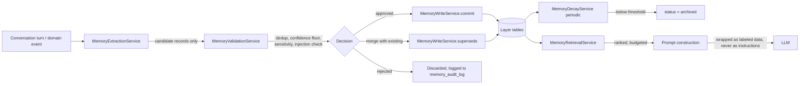

# Memory System — Architectural Proposal (v1.4)

> **Status: Draft architectural proposal — NOT approved for
> implementation.** This document contains no code and modifies none.
> SQL and Python shown below are illustrative design artifacts inside
> this proposal, not files added to the repository. Nothing here is
> built until this document is approved, per the same discipline
> `relationship_decision_engine_technical_design.md` and
> `ai_identity_technical_design.md` already established.
>
> **v1.4 (one small, targeted clarification — not a new review round):**
> added MEM-12 (4.5), stating precisely when a Decision Lesson may be
> superseded. A review pass correctly found this genuinely ambiguous
> between two readings; the actual answer is neither exactly — a lesson
> is superseded specifically when `outcome_evidence_refs`' input set
> grows (new evidence about a decision's real effect arrives later) and
> the same deterministic function, re-run against it, yields a
> different result — never because of reconsideration of the same,
> unchanged evidence. Kept `system_derived` (MEM-11) fully intact: the
> function itself never changes, only its input set does.
>
> **v1.1:** added Section 1.1 (the single-source-of-truth table for
> every information category, resolving the open question of what
> Memory may copy/interpret/change per category), sharpened the
> distinction between an ordinary preference update (3.5/MEM-9) and a
> genuine conflict (3.6) using a concrete example, and tightened
> selectivity at the extraction stage itself (MEM-8) rather than
> relying on scoring-then-pruning after the fact — all in response to
> a review pass, no architectural direction changed.
>
> **v1.2:** added Section 1.2 (ownership — a write-time question,
> explicitly distinct from Section 1.1's read-time source-of-truth
> question; for domain-owned categories the two collapse since Memory
> has zero write access regardless, but for Memory-owned categories
> they do not: the user owns a Semantic Fact or Relationship Memory
> record even though Memory System is what stores it, which is the
> actual reason erasure stays user-only even for Memory's own records).
> Also added MEM-10: a Relationship Memory `boundary` or `promise` may
> only be created from `user_stated` provenance, never from
> `ai_interpreted` alone — the two subtypes most consequential for a
> future Relationship Engine's reasoning get the highest evidentiary
> bar, deliberately higher than the bar for a soft preference.
>
> **v1.3 (consistency patch — no architectural direction changed):**
> a review pass against v1.2 found real gaps between what the
> invariants asserted and what the domain model/SQL/API actually
> supported. Fixed:
> 1. Added Section 4.6, a capability matrix stating explicitly which of
>    `supersede`/`dispute`/`archive`/`erase`/`provenance`/`sensitive`/
>    `significance_score`/`last_confirmed_at`/source-reference each
>    layer actually supports — resolving `episodic_events` missing
>    `superseded_by_id`, `decision_lessons` missing most shared fields,
>    and (found during this same pass, not by the review)
>    `relationship_memory` missing `significance_score` despite Section
>    3.7's text already saying it should have one. The common
>    `MemoryRecord` shape (Section 5) is now explicitly a superset, not
>    a claim every layer implements identically.
> 2. Defined `milestone` (4.4) precisely — it maps to the original
>    request's "important moments in the relationship," was correctly
>    added to the domain model, but never given its own definition
>    anywhere. Precise boundary against Episodic Memory's
>    `significant_moment`: about the *relationship itself*, not the
>    user's own life/progress.
> 3. Replaced `retrieve_for_context(context_query, max_records,
>    max_tokens, now)` with a structured `RetrievalRequest`
>    (`purpose`, `consumer`, `audience`, `allowed_layers`, plus the
>    original budget fields) — `audience` is a closed `Literal` with no
>    `partner_facing`/`shared` value at all today, so Section 3.12's
>    rule is enforced by the type itself, not by a caller's memory of a
>    convention.
> 4. Restructured `DecisionLesson` (4.5, 5) from a free-text `lesson:
>    str` into structured fields (`reason_codes`, `observed_outcome`,
>    `outcome_evidence_refs`) with `provenance` fixed to a new fourth
>    value, `system_derived` (**MEM-11**, 3.2) — distinct from
>    `ai_interpreted`, since a lesson's correctness depends on a
>    deterministic function, not a model's judgment. Any human-readable
>    summary is generated fresh at retrieval/presentation time, never
>    stored — keeping the Research Journal boundary (MEM-2) intact by
>    construction, not merely by instruction.
> 5. Split erasure into its own `UserMemoryCommandService` (Section 7),
>    structurally unreachable from `MemoryExtractionService`/
>    `MemoryDecayService`/`MemoryRetrievalService` — `MemoryWriteService`
>    now has no erasure-capable method at all. Two-phase
>    (`request_erasure()` + `confirm_erasure()`), gated by a new
>    `UserAuthorizedAction` marker.
> 6. Corrected "the same five-method shape" to six, and clarified that
>    a repository's own `erase()` is a mechanical DB capability whose
>    real access control is which *service* is ever wired with a
>    reference that exposes it.
>
> Depends on `philosophy.md` v1.16 (2.5 Consent & Control — the AI never
> deletes historical data on its own; 2.16 Continuity of Experience;
> 2.17 Facts/Interpretation/Research — this document's provenance model
> is that principle's direct extension), `relationship_decision_engine_technical_design.md`
> v1.1 (Section 3's discipline against inventing bundling objects where
> narrow reads already exist), and four implemented domain modules
> (`trust_manager`, `penalty_engine`, `recovery_plan`, `goal_management`).

## 1. Analysis of the Existing Project

### 1.1 Single Source of Truth Per Information Category

The question this table exists to answer, asked directly: **for every
category of information this system holds, who is the one authority,
and exactly what is the Memory System permitted to do with it.** This
is the single biggest risk a system like this one runs — quietly
becoming a second database holding the same facts, which then drift
out of sync with the real one. The rule this table encodes, stated
once: **Memory System is a *consumer* of every domain module's state,
never a second copy of it.** "Copy" below means a literal, potentially
stale duplicate stored in a Memory table — never allowed for anything
already owned elsewhere. A *point-in-time quotation* inside an Episodic
narrative ("Trust in the fitness domain was 0.42 when this happened")
is not a copy in this sense — it is a historical fact about what a
memory *said at the time it was written*, fixed the moment it's
written, never updated to track the domain module's current value, and
never treated as a live substitute for reading that module directly.

| Information type | Authoritative source | Memory may copy? | Memory may interpret? | Memory may change? |
|---|---|---|---|---|
| Trust scores/domain state | `trust_manager` | No (may quote a fixed point-in-time value inside an Episodic memory's text) | Yes (`ai_interpreted`, clearly labeled) | No |
| Penalty Window state | `penalty_engine` | No (point-in-time quotation only) | Yes (labeled) | No |
| Recovery Plan/Task state | `recovery_plan` | No (point-in-time quotation only) | Yes (labeled) | No |
| Goal state/evidence/evaluation | `goal_management` | No (point-in-time quotation only) | Yes (labeled) | No |
| Extension/Recovery Credit/`GoalChangeProposal` decisions | respective domain module | No (referenced by `source_ref`, not duplicated) | Yes — this is exactly what a `DecisionLesson` (4.5) is | No |
| `RelationshipContext`/`Decision` (once built) | Relationship/Decision Engine | No | Yes, as retrieval input only — never re-derives a `Decision` | No |
| Raw conversation content | `conversation_messages` (Phase 0) | No (Working Memory reads it live; nothing re-stores it) | Yes — this is the entire input to Extraction (Section 8) | No |
| The user's own stable preferences/facts about themselves | **Memory System (`semantic_facts`)** | — (this *is* the source) | Yes (`ai_interpreted` facts derived from patterns across `user_stated` ones) | Yes — its own records, via supersession (3.5), never in place |
| Relationship boundaries/promises/expectations | **Memory System (`relationship_memory`)** | — (this *is* the source) | Yes (labeled) | Yes — its own records, via supersession (3.5) |
| Whether a given moment is worth remembering, and its narrative | **Memory System (`episodic_events`)** for the *narrative*; the underlying event's own domain module for whether it *happened* | Partial — the narrative is original; the underlying fact is never re-asserted as if Memory owned it | Yes — curation is inherently interpretation | Yes — its own records, via supersession (3.5) |
| The Research Journal (`philosophy.md` 7.2) | not yet built | **No** | **No** | **No** |
| `ObservationRecord` (Phase 0) | the audit/runtime write path | **No** | **No** | **No** |

The pattern in the last three rows of the domain-owned block (Trust,
Penalty, Recovery Plan, Goal state) is deliberate and identical every
time: **copy = No, interpret = Yes (labeled), change = No.** This is
the same shape `implementation_conventions.md`'s Interpretation Handoff
Pattern already establishes between domain modules themselves — Memory
System is simply one more consumer applying it, not a new kind of
relationship the rest of the system doesn't already have a name for.

Before designing anything new, here is what already exists, and what
category of "memory" each thing already covers.

| Existing thing | What it already is | Memory-related category |
|---|---|---|
| `domain_events` (outbox) + every append-only record (`ConfirmationRecord`, `GoalVersion`, `ExtensionDecision`, `RecoveryCreditDecision`) | The system's ground-truth event log | **Regular database history** — already solved, nothing to add |
| `ConversationMessage` (Phase 0, `database/models.py`) | Raw message log, tied to Discord fields today | Raw material **Working Memory** is reconstructed from — not Working Memory itself |
| `ObservationRecord` (Phase 0) | Write-only from the runtime's perspective; read *only* by a human audit tool, *never* by the runtime (its own docstring: "never by the runtime") | **Not a memory source.** Explicitly the opposite of something retrievable into a prompt — see Section 3.1 |
| `TrustDomainState`/`TrustEvidence` (`trust_manager`) | Confidence-weighted, evidence-based trust per domain | **Trust** — already solved, nothing to add |
| `Goal`/`GoalVersion`/`GoalEvidence`/`GoalEvaluation` (`goal_management`) | The user's tracked objectives and their evidence | **Goals** — already solved, nothing to add |
| `RelationshipContext` (draft only, `relationship_decision_engine_technical_design.md`) | A *computed, per-run interpretation* (Coach/Keyholder perspectives), not yet implemented | **Relationship state** — this document must feed it, never duplicate or replace it (Section 4.4) |
| `ExtensionDecision`/`RecoveryCreditDecision`/`GoalChangeProposal`, and the future Decision Engine's `Decision` | Each domain module's own decision record, with a mandatory `explanation` | **History of decisions** — already solved as *facts*; this document adds only a thin, new *lessons* layer on top (Section 4.5) |
| The Research Journal (`philosophy.md` 7.2) | The system's own hypotheses/self-critique; **never feeds runtime decision-making** | Explicitly **walled off** from this design — see the invariant in Section 3.1 |

**No unified "user state" object exists anywhere in this system, and
none is introduced here.** This mirrors
`relationship_decision_engine_technical_design.md` Section 3's own
discipline: state stays owned by whichever module already owns it;
nothing here bundles Trust, Penalty, Recovery, or Goal state into a new
snapshot object. The Memory System reads those modules exactly the way
every other consumer in this system already does — through their
existing narrow public APIs — and never stores a shadow copy of what
they already track.

### 1.2 Ownership Is Not the Same Question as Source of Truth

Section 1.1 answers *where the truth lives*. It does not answer *who
may act on it* — a distinct question, and conflating the two is
exactly the kind of mistake that produces quiet, hard-to-find bugs in
a long-lived memory system later. Stated precisely: **source of truth**
is a read-time question (which system's answer is authoritative);
**owner** is a write-time question (who has standing to create, change,
or delete a given record). For domain-owned categories the two
collapse onto the same answer, since Memory has zero write access to
begin with (MEM-1) — but for the categories Memory itself is
authoritative for (Semantic Facts, Relationship Memory), they do not
collapse: **the user owns the fact even though Memory System is the
one storing it.** That distinction is the whole reason erasure (3.8)
is user-only even for records Memory itself created.

| Information type | Owner | Who may create | Who may change | Who may delete/erase |
|---|---|---|---|---|
| Trust scores/domain state | Trust Manager | Trust Manager's own algorithm | Trust Manager | N/A for Memory — not Memory's to delete; governed by `trust_manager`'s own rules, outside this document |
| Penalty Window state | Penalty Engine | Penalty Engine | Penalty Engine | N/A for Memory |
| Recovery Plan/Task state | Recovery Plan | Recovery Plan | Recovery Plan | N/A for Memory |
| Goal state/evidence/evaluation | Goal Management | Goal Management | Goal Management | N/A for Memory |
| Decisions (Extension/Recovery Credit/`GoalChangeProposal`, future `Decision`) | respective domain module | respective domain module | never — append-only by design | N/A for Memory |
| Semantic fact (preference/routine/interest/trait) | **User** — it is a fact about them, even though Memory stores it | Validated extraction pipeline (Section 8) — the same gate whether triggered by an explicit statement or inferred from one; there is no separate "user writes directly, bypassing Validation" path, since dedup/schema checks apply regardless of who prompted the write | Validated extraction pipeline, only via supersession (3.5), always traceable to a specific new user statement | **User only** (3.8) |
| Relationship memory (boundary/sensitive topic/promise/expectation/milestone, defined in 4.4) | **User** | Validated extraction pipeline — **but see MEM-10**: `boundary` and `promise` may only be created from `user_stated` provenance, never from `ai_interpreted` alone. `milestone` is exempt from MEM-10 (4.4) — either provenance is acceptable | Same path, via supersession, traceable to a new user statement | **User only** |
| Episodic event (narrative curation) | **Memory System** for the narrative itself; the underlying fact's own owner (above) is unaffected | Validated extraction pipeline | Validated extraction pipeline, via supersession, or an explicit user correction | **User only** (erasure); automatic archival, 3.8, is not a deletion and needs no owner's action |
| Decision lesson | **Memory System** | Validated extraction pipeline, deterministically derived from an existing decision record | Validated extraction pipeline, via supersession | **User only** |
| Research Journal | not yet built | N/A — zero Memory access (MEM-2) | N/A | N/A |
| `ObservationRecord` | the audit/runtime write path | N/A — zero Memory access (MEM-2) | N/A | N/A |

**MEM-10:** A `boundary` or `promise` record in Relationship Memory may
only be created from `user_stated` provenance. `ai_interpreted` alone —
however well-supported by pattern-matching across other records — is
never sufficient to create one, precisely because these two subtypes
are the ones most directly consequential for a future Relationship
Engine's reasoning (4.4), and inferring a boundary the user never
actually stated is a materially different, riskier act than inferring
a soft preference. `ai_interpreted` remains available for the two
softer Relationship Memory subtypes (`sensitive_topic`, `expectation`),
where being wrong is a much smaller failure than inventing a boundary
that was never actually set.

## 2. What Is Genuinely New

Five things do not exist anywhere in this project today, and are this
document's actual scope:

1. A place to remember **things said in conversation that don't fit any
   domain module's schema** — a mood, a life event, an offhand
   preference — without inventing a new domain module for each one.
2. A **significance-scored, curated** memory of events (Episodic),
   distinct from both the exhaustive mechanical event log (`domain_events`)
   and the audit-only `ObservationRecord`.
3. A **stable-fact store** about the user as a person (Semantic) —
   preferences, routines, long-term interests — that is not a tracked
   objective.
4. A place for **relationship-specific facts** (boundaries, sensitive
   topics, promises, expectations) that the future Relationship Engine
   will read as one of its Domain State inputs — not a competing
   implementation of `RelationshipContext` itself.
5. A **retrieval layer** that turns all of the above (plus the
   already-existing decision records) into a bounded, safe set of
   context for prompt construction — the actual reason any of this
   needs to be built at all.

## 3. Cross-Cutting Invariants

These apply to every layer in Section 4, stated once here rather than
repeated five times.

### 3.1 The Boundary With Existing Systems

**Memory System is a service other modules call, never a parallel
source of truth they must reconcile against.** Concretely: a future
Relationship Engine reading Relationship Memory (4.4), or a future
Decision Engine reading a `DecisionLesson` (4.5), does so the same way
it reads Trust Manager or Penalty Engine today — through a narrow read
API, receiving an answer, never receiving two candidate answers it then
has to arbitrate between. Section 1.1's table is this principle applied
to every information category in the system, one at a time.

- **MEM-1:** The Memory System never writes to any table owned by
  `trust_manager`, `penalty_engine`, `recovery_plan`, `goal_management`,
  or (once built) the Relationship/Decision Engine. It is a *consumer*
  of their public read APIs, exactly like every other module in this
  system — never a second source of truth for their state.
- **MEM-2:** The Memory System never reads from, or surfaces into any
  prompt, the Research Journal (`philosophy.md` 7.2) or
  `ObservationRecord`. Both are explicitly walled off — 7.2's own
  invariant ("never feeds directly into runtime decision-making")
  would otherwise be silently violated by a system whose entire
  purpose is feeding retrieved content into runtime prompts. A
  "lesson" in Decision Memory (Section 4.5) is a **retrieved fact**
  about a past decision, never a self-critique or hypothesis in the
  Research Journal's sense.
- **MEM-3:** Personality/Identity (`ai_identity_technical_design.md`)
  never reads or writes any Memory System table directly, and never
  changes what is remembered — only how a retrieved memory's content
  might color the *tone* of an already-composed message, subject to
  the exact same "never change facts" discipline
  `ai_identity_technical_design.md` ID-3 already establishes for a
  `Decision`'s `explanation`.
- **MEM-4:** A `user_stated` claim (Section 3.2) is never treated as
  authoritative for any domain module's own state. If a user says "I
  finished the recovery task" but `recovery_plan`'s own record
  disagrees, `recovery_plan`'s record governs every real decision;
  the claim is stored (it is still a real thing the user said,
  relevant to the relationship) but flagged as contradicted (Section
  3.6) and never used to override, infer, or backfill any domain
  module's state.

### 3.2 Facts, Claims, and Interpretation (extending `philosophy.md` 2.17)

Every stored memory carries exactly one **provenance** value:

- **`system_fact`** — read from a domain module's own public API.
  Highest baseline confidence; this document never disputes it.
- **`user_stated`** — the user said this. Real, but not verified —
  people misremember, exaggerate, or occasionally say something untrue
  entirely deliberately (Section 3.9). Confidence starts moderate and
  is adjusted by corroboration or contradiction over time.
- **`ai_interpreted`** — a derived reading (e.g. "seems to prefer
  shorter check-ins on weekdays") produced by pattern-matching across
  multiple `user_stated`/`system_fact` records. Confidence is always
  capped below what either of its inputs individually carries, and it
  is always labeled as interpretation, never presented as if it were
  something the user said.
- **`system_derived`** (**MEM-11**, added v1.3) — deterministically
  computed by Memory System's own code from existing, immutable records
  (today: exclusively Decision Lessons, Section 4.5/10.1) — no LLM
  involved in producing the stored value itself, and no pattern-matching
  judgment call the way `ai_interpreted` involves. This is deliberately
  a separate value from `ai_interpreted`: an `ai_interpreted` record's
  correctness depends on a model's judgment; a `system_derived` record's
  correctness depends only on the deterministic function that computed
  it, exactly the same distinction `relationship_decision_engine_technical_design.md`
  draws between Entitlement Classification (always deterministic) and a
  Discretionary decision's reasoning (judgment-based).

No memory record is ever left with an ambiguous provenance value —
every write, at every layer, is one of these four.

### 3.3 When Information May Be Stored

**MEM-5:** Nothing an LLM produces is written to memory directly. A
language model may only produce a **candidate** memory record — the
same "propose, never decide" boundary
`relationship_decision_engine_technical_design.md` already establishes
between a perspective and a decision. A deterministic **Validation**
step (Section 6) is the only path from candidate to stored memory —
checking schema conformance, confidence floor, sensitivity policy,
injection-pattern rejection (Section 3.11), and deduplication (Section
3.4) — before anything is committed. This is the same shape as
Entitlement Classification happening before a `Decision` is reached:
a gate that runs *before* storage, not a filter applied after the
fact.

**MEM-8 (selectivity):** Memory is not a transcript. Extraction is
restricted, by design, to a small, closed set of candidate-eligible
triggers — not "anything that seems potentially interesting" scored
after the fact:

- an explicit statement of a durable preference, fact, boundary,
  promise, or expectation ("I don't like X," "please don't bring up Y"),
- a moment that is unusually emotionally significant in context (a
  clear success, a clear failure, a clear conflict) — not every
  emotional beat of ordinary conversation,
- an explicit user request to remember something,
- a moment directly correlated with a significant domain event (an
  Incident being confirmed, a Goal completing or being abandoned).

Everything else in a conversation — the large majority of any normal
exchange — produces **no candidate at all**. This is a stricter rule
than "score everything, keep what clears a threshold": most turns
never reach Validation to begin with, because Extraction itself never
proposes a candidate for them. Selectivity is enforced at the earliest
possible point, not by aggressively pruning afterward.

### 3.4 Deduplication

Before a validated candidate is stored, it is checked against existing
**active** records of the same layer and (where applicable) the same
subject — in the MVP, by normalized text/keyword matching (Section 13);
in the embeddings variant (Section 14), by vector similarity above a
threshold. A near-duplicate does not create a second row — it updates
`last_confirmed_at` on the existing record (Section 3.7) and may raise
its confidence, since repetition is itself corroborating evidence.

### 3.5 Updating Versus Replacing Old Facts

No memory record is ever edited in place. A changed fact creates a
**new** record and marks the old one `superseded_by` the new one's id —
the same append-only-with-status-field convention this project already
uses everywhere (`GoalVersion`, `ConfirmationRecord`). A superseded
record is never deleted — it remains available for audit and for
understanding how a belief about the user changed over time, exactly
what 2.16 (Continuity of Experience) requires.

**MEM-9:** This is the default, expected path for a preference that
simply changed over time — e.g. the user says "I love coffee" today
and, six months later, "I don't drink coffee anymore." Both statements
were true when made. The second one **supersedes** the first — one
active record, one clear current answer, and full history of the
change preserved via `superseded_by`. This is a routine update, not a
Section 3.6 conflict: nothing here needs to be marked `disputed`, and
nothing needs escalating back to the user. Section 3.6 is reserved for
a narrower, genuinely different case — see there for the distinction.

### 3.6 Conflicts Between Memories

**The distinction from 3.5, stated precisely:** if a new candidate
asserts a *different current value for the same subject*, with no
particular reason to think the old value is still simultaneously true,
it is an **update** (3.5/MEM-9) — resolved automatically, by
supersession, with no dispute state at all. A candidate is instead a
**conflict**, requiring Section 3.6's handling, only when there is a
real reason to think *both* might still be true at once — most
commonly: a `user_stated` claim that disagrees with a `system_fact`
(always MEM-4's territory — the `system_fact` governs, the claim is
kept but flagged, never disputed as if they were peers), or two
`user_stated` claims close together in time with no clear
supersession relationship between them (e.g. contradicting themselves
within the same conversation, not across six months).

When a genuine conflict (not merely an update) is detected: neither
record is silently deleted or silently preferred. Both are marked
`disputed`, linked to each other via a `memory_conflicts` row, and each
has its confidence lowered. Resolution happens either through further
corroboration (one gets confirmed again, the other doesn't, and normal
decay — Section 3.7 — handles it) or, for anything significant enough
to matter, by surfacing it back to the user for a real answer — never
by the system silently picking a side.

### 3.7 Confidence Score and Time-Based Decay

Every record has a `confidence` (`0.0`–`1.0`, set at creation per
Section 3.2, adjusted by corroboration/contradiction) and a
`significance_score` (Episodic/Relationship layers only — Section 4)
that **decays over time unless reinforced**. Decay lowers *retrieval
priority*, nothing else.

**MEM-6:** Decay never deletes a record and never lowers `confidence`
below a floor that would make the record read as false — decay only
makes an old, unreinforced memory less likely to be pulled into a
prompt, exactly mirroring 2.5's "the AI never deletes historical data
on its own." A decayed-to-low-priority record is **archived** (a status
transition, still fully present in the database) once it falls below a
retrieval-relevance floor for long enough — archived records are
excluded from normal retrieval but never physically removed.

### 3.8 Forgetting, Archival, and User-Requested Erasure

Three genuinely different things, kept separate:

- **Decay** (3.7) — automatic, continuous, affects priority only.
- **Archival** — automatic, a status transition once decay crosses a
  threshold; reversible (an archived memory can still be looked up
  directly, just not retrieved by default).
- **Erasure** — **only ever user-initiated**, never automatic and never
  the AI's own decision (2.5's explicit prohibition:
  "[the AI never] deletes historical data" on its own). Modeled as a
  two-step, explicitly consented action
  (`UserMemoryCommandService.request_erasure()` +
  `.confirm_erasure()`, Section 7 — restructured in v1.3 into its own
  service, structurally unreachable from extraction/validation/decay/
  retrieval, not merely documented as restricted): the record's content
  is overwritten with a tombstone marker (`"[erased at user's request,
  <date>]"`), while a minimal audit trail (that *something* existed
  here and was erased, when, and why) is preserved — satisfying both
  the user's real right to have something removed and this project's
  standing rule (`database/migrations/README.md`) against silently
  destructive operations.

### 3.9 False or Manipulative Claims

A `user_stated` claim is stored as exactly that — a thing the user
said — never silently upgraded to `system_fact`. Section 3.1's MEM-4
is the primary defense: nothing `user_stated` can ever override a
domain module's own record, however confidently or repeatedly it is
asserted. Repetition of a `user_stated` claim raises its own
confidence (3.4) but never crosses into `system_fact` territory — that
provenance value is reserved exclusively for what a domain module's
own API actually returns.

### 3.10 Retrieval for Prompt Construction, and the Context Budget

**MEM-7:** Retrieval never returns "everything relevant" — it returns
the top-`K` records (or top by a token budget, whichever binds first)
ranked by a composite of relevance-to-current-context, significance,
confidence, and recency. Exceeding the budget silently drops the
lowest-ranked items rather than truncating content mid-record — a
partial memory is worse than one fewer whole memory.

### 3.11 Protection Against Prompt Injection Stored in Memory

Two independent layers, not one:

- **At storage time:** Validation (3.3) rejects or flags a candidate
  whose content reads as an instruction directed at the AI ("ignore
  previous instructions," "always respond with...") rather than a
  third-person fact about the user — the same posture this assistant's
  own operating principles already take toward any observed content
  from an external source: **data is not commands**, and content that
  tries to act as one is treated with suspicion, not obeyed.
- **At retrieval time:** every memory inserted into a prompt is wrapped
  in a clearly delimited, labeled data block (never concatenated as if
  it were part of the system's own instructions) — so that even a
  malicious record that slipped past storage-time validation cannot be
  read by the model as an instruction rather than as quoted user
  history.

### 3.12 Sensitive Data

Every record carries a `sensitive` flag (boolean in the MVP; a tiered
level is a plausible future refinement, not decided here). Relationship
Memory defaults to `sensitive=true`. A sensitive record requires a
stricter relevance/purpose match before retrieval includes it, and is
never eligible for any future partner-facing or shared surface,
regardless of how relevant it would otherwise score.

## 4. The Five Memory Layers

### 4.1 Working Memory

> **Partially implemented — read carefully, the implementation
> diverges from this section's own original text below.** See
> `memory_system/README.md` for the exact boundary. What was actually
> built is a simpler, fully non-persistent
> `InMemoryWorkingMemory` — a bounded, per-subject, process-lifetime
> conversation-turn buffer. **Conversation Engine Slice 3 has since
> wired it in** — `conversation_engine`'s own former
> `TransitionalRecentMessageBuffer` has been removed entirely, and
> `ConversationEngine` now reads/writes through `InMemoryWorkingMemory`
> directly (via `WorkingMemoryReader`/`WorkingMemoryWriter`, injected —
> not through a `ConversationContextProvider`, despite what
> `conversation_engine_technical_design.md`'s own Slice 3 section
> originally described). This section's own original text below
> describes reconstructing Working Memory "primarily from the existing
> `conversation_messages` table" plus a new durable "what is the user
> in the middle of right now" pointer — **neither of those was built.**
> The implemented slice is narrower and does not persist anything at
> all. This document's own global status remains unchanged (`Draft for
> review, not approved for implementation`) — only this specific,
> narrower slice has been built; the rest of Working Memory as
> originally described here, and all four remaining layers, remain
> entirely unimplemented and unapproved, with persistent memory of any
> kind additionally blocked
> on a privacy/consent design that does not yet exist.

**Responsibility:** the current conversation, the active task (if the
user is mid-way through something — creating a Goal, reviewing an
Extension proposal), and short-lived context that has no reason to
outlive the conversation.

**Mostly not a new persisted store.** Reconstructed per request
primarily from the existing `conversation_messages` table (recent
window). The one genuinely new, small piece of durable state is a
single-row "what is the user in the middle of right now" pointer — see
Section 5.

### 4.2 Episodic Memory

**Responsibility:** significant events — achievements, failures,
conflicts, behavior changes — worth recalling later, distinct from
`ObservationRecord` (audit-only, MEM-2) and from each domain module's
own exhaustive event log (mechanical, not curated for salience). An
Episodic record may reference a domain event (an Incident, a completed
Goal) but is not a copy of it — it is the *curated, narrative* memory
of it.

### 4.3 Semantic Memory

**Responsibility:** stable facts about the user as a person —
preferences, routines, long-term interests — that are not tracked
objectives. The boundary against Goal Management: a routine becomes a
Goal the moment it is deliberately tracked and evaluated
(`goal_management`'s own domain); until then, "usually goes to the gym
Mondays" is a Semantic fact, not a Goal.

### 4.4 Relationship Memory

**Responsibility:** boundaries, sensitive topics, promises,
expectations, and milestones specific to this relationship. **Feeds the
future Relationship Engine as one of its Domain State read sources** —
the Relationship Engine's Coach/Keyholder perspectives (Section 4 of
`relationship_decision_engine_technical_design.md`) would read this
layer's active records the same way they read Trust Manager or Penalty
Engine today; this document does not implement that read integration,
only makes the data available for it (Section 17's open question).

**`milestone` (defined precisely here, v1.3 — previously listed in the
domain model with no accompanying definition, a genuine gap):** a
significant moment **in the relationship between the user and the
system itself** — e.g. the first time the user opened up about a
difficult topic, a point where a held boundary visibly strengthened
trust, an anniversary of the relationship's own start. The boundary
against Episodic Memory's `significant_moment` (4.2) is precise: an
Episodic event is about the *user's own life or progress* (a Goal
completed, a hard week); a `milestone` is about *the relationship
itself* — the same event essentially never qualifies as both, since
the two ask different questions ("did something significant happen to
this person" versus "did something significant happen *between us*").
Owner: User, matching every other Relationship Memory subtype (1.2).
Provenance: either `user_stated` or `ai_interpreted` — unlike
`boundary`/`promise`, MEM-10's restriction does not apply, since being
wrong about a milestone is a low-stakes error, not a consequential one.
Extraction trigger: the same "unusually emotionally significant"
category MEM-8 already defines, scoped specifically to
relationship-directed significance rather than general life
significance.

### 4.5 Decision Memory

**Responsibility:** a thin, read-oriented layer over decisions that
already exist as facts elsewhere (`ExtensionDecision`,
`RecoveryCreditDecision`, `GoalChangeProposal`, and — once built — the
Decision Engine's own `Decision`), plus exactly one new entity: a
**lesson** — never a hypothesis or self-critique (MEM-2 keeps that
firmly in the Research Journal's exclusive territory).

**Restructured in v1.3 to make "deterministic" actually true, not just
asserted.** A free-text summary produced by an LLM is not a
deterministic artifact, however faithfully it was validated — so the
*stored* Decision Lesson is now a small set of structured fields
(`reason_codes`, `observed_outcome`, `outcome_evidence_refs` — Section
5), each computed by a fixed function of the source decision record and
whatever later evidence confirms or contradicts its expected effect
(e.g. a Goal's later `GoalEvidence`, a Trust recalculation that followed
an Incident). **No LLM involvement in what gets stored.** A
human-readable summary is generated only at retrieval/presentation
time, fresh, from these structured fields — never itself stored as if
it were the fact. This keeps the Research Journal boundary (MEM-2)
intact by construction: there is no stored free-text "reflection"
field anywhere in this layer for a self-critique to accidentally end
up in.

**MEM-12 (v1.4 — precisely when a Decision Lesson may be superseded,
previously left ambiguous):** neither of the two readings a review pass
posed is quite right as stated. It is not "the system's opinion
changed" (that would make it interpretation, contradicting
`system_derived`'s whole point) — but it is also not "a pure projection
of a fixed input set" in the sense of never changing at all, since a
lesson that could never be superseded would make Section 4.6 listing
`supersede: Yes` simply unreachable in practice. The actual answer:
**the deterministic function's input set is not fixed at creation
time — specifically `outcome_evidence_refs` can genuinely grow as more
evidence about a decision's real-world effect becomes available over
the following days or weeks.** A Decision Lesson is superseded
precisely when new outcome evidence arrives and the same deterministic
function, re-run against the enlarged evidence set, produces a
different `observed_outcome` or additional `reason_codes` than the
original computation had access to — never because a human or a model
reconsidered the same, unchanged evidence. This keeps the lesson fully
deterministic (the same input set always yields the same output) while
still making supersession a real, expected, and precisely triggerable
event, not a vague "the system changed its mind."

### 4.6 Capability Matrix — What Each Layer Actually Supports

Added in v1.3, resolving a real inconsistency the domain model (Section
5) and SQL (Section 6) previously had with each other: Section 5's
`MemoryRecord` "common shape" listed fields not every concrete SQL
table actually carried. **Resolved in favor of explicit, deliberate
differences per layer** — not because every layer secretly needs the
same shape, but because forcing an artificial uniform shape onto data
that doesn't need it (a `DecisionLesson` reconfirmed by repetition
makes no sense) would be its own kind of bug waiting to happen.

| Capability | Semantic Fact | Episodic Event | Relationship Memory | Decision Lesson |
|---|---|---|---|---|
| `supersede` (3.5) | Yes | Yes | Yes | Yes — but only when new outcome evidence enlarges the input set (MEM-12), never a bare reconsideration |
| `dispute` (3.6) | Yes | No — a wrong narrative is corrected by supersession, not disputed; nothing about a curated story is a competing truth-claim the way a stated fact can be | Yes — especially relevant for `boundary`/`promise` given MEM-4/MEM-10 | No — derived from an immutable decision record; if wrong, it is superseded, never disputed |
| `archive` (3.8) | Yes | Yes | Yes | Yes |
| `erase` (3.8) | Yes, user-only | Yes, user-only | Yes, user-only | Yes, user-only |
| `provenance` (3.2) | `user_stated` / `ai_interpreted` | `user_stated` / `ai_interpreted` | `user_stated` / `ai_interpreted` (MEM-10 restricts `boundary`/`promise` to `user_stated` only) | **`system_derived` only** (MEM-11) |
| `sensitive` (3.12) | Yes | Yes | Yes, defaults `true` | Yes |
| `significance_score` (3.7) | **No** — ranked by confidence/recency/topical match alone; Section 9's formula uses a fixed baseline where this field doesn't exist | Yes | Yes | **No** — same reasoning as `last_confirmed_at` below |
| source reference | Yes — generic `source_ref_json` | Yes — generic `source_ref_json` | Yes — generic `source_ref_json` | Yes — but via its own, more specific `source_decision_type`/`source_decision_id` pair rather than the generic field, since it always points to exactly one decision record and a generic reference would be strictly less precise |
| `last_confirmed_at` / decay (3.7) | Yes — repetition is corroborating evidence | Yes | Yes | **No** — a lesson isn't "reconfirmed" the way a stated preference is; its relevance is driven by the source decision's own recency and category match, not reinforcement |

## 5. Domain Model (Illustrative — Not Code)

```
WorkingContext (singleton, one row)
    active_task: str | None
    active_task_state: dict
    updated_at: datetime

MemoryRecord (the common SHAPE every layer specializes -- not every
field applies to every layer; see Section 4.6's capability matrix for
exactly which layer supports which of these)
    id, layer, provenance, confidence,
    status ('active' | 'superseded' | 'disputed' | 'archived' | 'erased'),
    superseded_by_id: str | None,
    sensitive: bool,
    created_at,
    source_ref: dict  # e.g. {"conversation_message_id": ...} or {"domain": "goal_management", "goal_group_id": ...}
    # significance_score, last_confirmed_at: Episodic/Relationship only (3.7) -- not Semantic Fact, not Decision Lesson; see 4.6
    # dispute-related fields: not applicable to Episodic or Decision Lesson -- see 4.6

SemanticFact(MemoryRecord):
    fact_type: 'preference' | 'routine' | 'interest' | 'trait'
    content: str

EpisodicEvent(MemoryRecord):
    event_type: 'achievement' | 'failure' | 'conflict' | 'behavior_change' | 'significant_moment'
    summary: str
    occurred_at: datetime

RelationshipMemory(MemoryRecord):
    memory_type: 'boundary' | 'sensitive_topic' | 'promise' | 'expectation' | 'milestone'  # see 4.4 for milestone's definition
    content: str
    fulfilled_at: datetime | None   # for promises only

DecisionLesson(MemoryRecord):
    # Restructured in v1.3 (4.5) -- no free-text "lesson" field.
    # provenance is always 'system_derived' (MEM-11); no significance_score
    # or last_confirmed_at (4.6); dispute is not supported (4.6).
    source_decision_type: str
    source_decision_id: str
    reason_codes: tuple[str, ...]              # a fixed vocabulary, not free text -- e.g. ('high_cooperation', 'first_occurrence')
    observed_outcome: str                        # a fixed category -- e.g. 'as_expected' | 'unexpected_positive' | 'unexpected_negative' | 'not_yet_observed'
    outcome_evidence_refs: tuple[str, ...]         # references to later evidence confirming/contradicting the expected effect, e.g. a GoalEvidence id

MemoryConflict:
    id, record_a_id, record_b_id, created_at, resolved_at, resolution: str | None

MemoryAuditLogEntry:
    id, memory_layer, memory_id, action
      ('created'|'updated'|'superseded'|'disputed'|'archived'|'erasure_requested'|'erased'|'retrieved'),
    performed_by: 'extraction_pipeline' | 'user_request' | 'decay_process' | 'admin',
    reason: str | None, created_at: datetime
```

## 6. SQL Design (Illustrative — Not Applied)

```sql
-- One table per concrete layer (not a single polymorphic table) --
-- matches this project's existing convention of one table per
-- concrete entity, never a generic "everything" table.

CREATE TABLE working_context (
    id INTEGER PRIMARY KEY CHECK (id = 1),
    active_task TEXT,
    active_task_state_json TEXT,
    updated_at TEXT NOT NULL
);

CREATE TABLE semantic_facts (
    id TEXT PRIMARY KEY,
    fact_type TEXT NOT NULL,
    content TEXT NOT NULL,
    provenance TEXT NOT NULL,
    confidence REAL NOT NULL,
    status TEXT NOT NULL DEFAULT 'active',
    superseded_by_id TEXT REFERENCES semantic_facts(id),
    sensitive INTEGER NOT NULL DEFAULT 0,
    source_ref_json TEXT,
    created_at TEXT NOT NULL,
    last_confirmed_at TEXT NOT NULL
);
CREATE INDEX idx_semantic_facts_status ON semantic_facts(status);
CREATE INDEX idx_semantic_facts_type ON semantic_facts(fact_type);

CREATE TABLE episodic_events (
    id TEXT PRIMARY KEY,
    event_type TEXT NOT NULL,
    summary TEXT NOT NULL,
    provenance TEXT NOT NULL,
    confidence REAL NOT NULL,
    significance_score REAL NOT NULL,
    status TEXT NOT NULL DEFAULT 'active',
    superseded_by_id TEXT REFERENCES episodic_events(id),
    sensitive INTEGER NOT NULL DEFAULT 0,
    source_ref_json TEXT,
    occurred_at TEXT NOT NULL,
    created_at TEXT NOT NULL,
    last_confirmed_at TEXT NOT NULL
);
CREATE INDEX idx_episodic_events_status_sig ON episodic_events(status, significance_score);
CREATE INDEX idx_episodic_events_occurred ON episodic_events(occurred_at);

CREATE TABLE relationship_memory (
    id TEXT PRIMARY KEY,
    memory_type TEXT NOT NULL,
    content TEXT NOT NULL,
    provenance TEXT NOT NULL,
    confidence REAL NOT NULL,
    significance_score REAL NOT NULL,
    status TEXT NOT NULL DEFAULT 'active',
    superseded_by_id TEXT REFERENCES relationship_memory(id),
    fulfilled_at TEXT,
    sensitive INTEGER NOT NULL DEFAULT 1,
    source_ref_json TEXT,
    created_at TEXT NOT NULL,
    last_confirmed_at TEXT NOT NULL
);
CREATE INDEX idx_relationship_memory_type_status ON relationship_memory(memory_type, status);

-- Restructured in v1.3 (4.5/4.6): no free-text field, no
-- last_confirmed_at (decay doesn't apply the same way here), no
-- 'disputed' status (dispute isn't supported for this layer).
-- provenance is always 'system_derived' (MEM-11) -- still stored as a
-- column, not hardcoded, so the invariant is enforced at write time
-- (application layer) and remains auditable, not implied by omission.
CREATE TABLE decision_lessons (
    id TEXT PRIMARY KEY,
    source_decision_type TEXT NOT NULL,
    source_decision_id TEXT NOT NULL,
    reason_codes_json TEXT NOT NULL,        -- JSON array of a fixed vocabulary, never free text
    observed_outcome TEXT NOT NULL,          -- fixed category: 'as_expected' | 'unexpected_positive' | 'unexpected_negative' | 'not_yet_observed'
    outcome_evidence_refs_json TEXT,         -- JSON array of references to later confirming/contradicting evidence
    provenance TEXT NOT NULL DEFAULT 'system_derived',
    confidence REAL NOT NULL,
    status TEXT NOT NULL DEFAULT 'active',   -- 'active' | 'superseded' | 'archived' | 'erased' -- never 'disputed' (4.6)
    superseded_by_id TEXT REFERENCES decision_lessons(id),
    sensitive INTEGER NOT NULL DEFAULT 0,
    created_at TEXT NOT NULL
);
CREATE INDEX idx_decision_lessons_source ON decision_lessons(source_decision_type, source_decision_id);

CREATE TABLE memory_conflicts (
    id TEXT PRIMARY KEY,
    record_a_layer TEXT NOT NULL, record_a_id TEXT NOT NULL,
    record_b_layer TEXT NOT NULL, record_b_id TEXT NOT NULL,
    created_at TEXT NOT NULL,
    resolved_at TEXT,
    resolution TEXT
);

-- Shared audit trail across every layer above (MEM-1..MEM-7 all leave
-- a trace here) -- append-only, mirrors this project's outbox/audit conventions.
CREATE TABLE memory_audit_log (
    id TEXT PRIMARY KEY,
    memory_layer TEXT NOT NULL,
    memory_id TEXT NOT NULL,
    action TEXT NOT NULL,
    performed_by TEXT NOT NULL,
    reason TEXT,
    created_at TEXT NOT NULL
);
CREATE INDEX idx_memory_audit_log_record ON memory_audit_log(memory_layer, memory_id);
```

No FK into any `trust_manager`/`penalty_engine`/`recovery_plan`/
`goal_management` table (MEM-1) — `source_ref_json` stores a
*reference* (e.g. `{"domain": "goal_management", "goal_group_id": "..."}`),
never a hard FK, since Memory System must remain readable even if a
referenced domain record is later itself archived/restructured.

## 7. Application Services (Illustrative — Not Code)

```python
class MemoryExtractionService:
    """Runs after a conversation turn (or a relevant domain event).
    Produces CANDIDATE records only -- never writes directly (MEM-5)."""
    def extract_candidates(self, conversation_context, recent_domain_events) -> list[CandidateMemory]: ...

class MemoryValidationService:
    """The deterministic gate between candidate and stored (Section 3.3)."""
    def validate(self, candidate: CandidateMemory) -> ValidationResult:
        """Checks schema conformance, confidence floor, sensitivity
        policy, injection-pattern rejection (3.11), and dedup (3.4).
        Returns either an approved-to-store candidate, a merge-with-
        existing-record instruction, or a rejection with reason."""

class MemoryWriteService:
    """The only thing allowed to call each layer's repository
    .create()/.supersede()/.archive(). Deliberately has NO erasure
    capability at all (v1.3) -- not merely a documented restriction,
    but a real gap in this interface: no amount of a caller's
    carelessness can reach erasure from here, because the method
    simply doesn't exist on this class."""
    def commit(self, validated: ValidationResult, *, now: datetime) -> MemoryRecord: ...
    def supersede(self, old_id: str, new_content: CandidateMemory, *, now: datetime) -> MemoryRecord: ...
    def archive(self, record_id: str, *, now: datetime) -> None:
        """Called by MemoryDecayService (automatic, 3.8) -- a status
        transition, never erasure."""

class UserMemoryCommandService:
    """Added v1.3. The ONLY class anywhere in this design with an
    erasure-capable method. MemoryExtractionService, MemoryDecayService,
    and MemoryRetrievalService hold no reference to this service at
    all -- it is constructed and reachable exclusively from a genuine,
    user-initiated command path (e.g. an explicit Discord command, once
    one exists in `application/`'s command set), never from anything
    running as part of the extraction/validation/decay/retrieval
    pipeline. Two-phase, per 3.8's "explicitly consented action":"""
    def request_erasure(
        self, memory_id: str, *, reason: str, authorized_by: UserAuthorizedAction, now: datetime,
    ) -> ErasureConfirmationToken:
        """Step 1 of 2: records the request, returns a token. Does not
        yet erase anything."""
    def confirm_erasure(self, token: ErasureConfirmationToken, *, now: datetime) -> None:
        """Step 2 of 2: the user's explicit second confirmation. Only
        this call actually tombstones the record's content."""

@dataclass(frozen=True, kw_only=True)
class UserAuthorizedAction:
    """Proof that a specific call genuinely originated from a real user
    action, not from any internal service acting on its own initiative.
    `actor` has exactly one legal value today ('user') -- this system
    is single-user (Section 1.1's ownership table); the field exists so
    the shape is already correct if that ever changes, not because
    multiple actors exist now."""
    actor: Literal['user']
    confirmed_at: datetime

class MemoryDecayService:
    """Runs periodically (ties into the same Phase-5 scheduler need
    already flagged independently in trust_manager/README.md and
    relationship_decision_engine_technical_design.md Section 2.1 --
    a fourth place converging on the same missing piece)."""
    def apply_decay(self, *, now: datetime) -> None: ...
    def archive_below_threshold(self, *, now: datetime) -> list[str]: ...

class MemoryRetrievalService:
    """The only read path prompt construction should ever use (3.10)."""
    def retrieve_for_context(self, request: RetrievalRequest, *, now: datetime) -> list[RetrievedMemory]: ...
```

**`RetrievalRequest` (added v1.3 — the original `context_query`/
`max_records`/`max_tokens` signature was, on review, not actually
capable of expressing this document's own sensitivity rule.** A free
string cannot be a permission boundary; Section 3.12's "never eligible
for any future partner-facing or shared surface" needs something the
type system itself can check, not a convention a caller has to
remember:

```python
@dataclass(frozen=True, kw_only=True)
class RetrievalRequest:
    context_query: str
    purpose: str          # e.g. 'prompt_construction' | 'relationship_engine_input' | 'decision_engine_input'
    consumer: str           # the calling module/service -- e.g. 'application_service', 'relationship_engine'
    audience: Literal['user_facing', 'internal_only']
    # Deliberately NOT an open string, and deliberately has no
    # 'partner_facing'/'shared' value at all today -- 3.12's rule is
    # enforced by the type itself having no way to ask for that,
    # rather than by a runtime check a future caller could get wrong.
    allowed_layers: tuple[Literal['semantic', 'episodic', 'relationship', 'decision_lesson'], ...]
    max_records: int
    max_tokens: int
```

`sensitive=true` records are only ever included when `audience` is one
of the two values above (each with its own, separately-specified
matching rule at implementation time) — never as a side effect of a
high topical-match score alone, regardless of `purpose`.

### Repository Interfaces (one per layer, same shape as every existing module)

```python
class SemanticFactRepository(Protocol):
    def create(self, fact: SemanticFact) -> SemanticFact: ...
    def get(self, fact_id: str) -> SemanticFact | None: ...
    def get_active_by_type(self, fact_type: str) -> list[SemanticFact]: ...
    def supersede(self, old_id: str, new: SemanticFact) -> SemanticFact: ...
    def archive(self, fact_id: str, *, now: datetime) -> None: ...
    def erase(self, fact_id: str, *, now: datetime) -> None: ...
    # A mechanical DB-level capability -- SOMETHING has to write the
    # tombstone. The real safety boundary is which SERVICE is ever
    # constructed with a reference to a repository that permits calling
    # it: only UserMemoryCommandService (Section 7) is wired that way
    # in this design -- MemoryWriteService's own repository reference,
    # in the actual dependency injection setup, would not expose this
    # method's capability at all, not merely avoid calling it by
    # convention.

# EpisodicEventRepository, RelationshipMemoryRepository,
# DecisionLessonRepository: the same six-method shape per layer
# (corrected in v1.3 -- previously miscounted as five), each honoring
# only the capabilities Section 4.6's matrix actually assigns it (e.g.
# DecisionLessonRepository's equivalent of `get_active_by_type` is a
# lookup by `source_decision_type`/`source_decision_id` instead, since
# that layer has no `fact_type`-style category).
```

## 8. Process: Extraction → Validation → Storage → Retrieval



## 9. Relevance Scoring (Retrieval)

Composite, deterministic ranking — never delegated to the LLM itself:

```
relevance_score =
    w1 * topical_match(record, current_context)      # MVP: keyword overlap; future: embedding cosine similarity
  + w2 * significance_score(record, now)               # decayed per 3.7 -- fixed baseline for layers without this field (4.6): Semantic Fact, Decision Lesson
  + w3 * confidence(record)
  + w4 * recency(record.last_confirmed_at, now)          # Decision Lesson has no last_confirmed_at (4.6) -- uses created_at (equivalently, the source decision's own recency) instead
```

Weights (`w1..w4`) are `BOOTSTRAP_DEFAULT`-tagged, undecided-owner
constants once implementation begins — not assigned here, consistent
with this project's standing rule against pre-assigning ownership of a
calibration value casually.

## 10. Write Policy (Summary)

| Rule | Statement |
|---|---|
| MEM-5 | No LLM output is stored without passing Validation |
| MEM-8 | Extraction proposes a candidate only for a closed set of trigger types (3.3) — most conversation produces no candidate at all, not "everything scored, most discarded" |
| 3.4 | A near-duplicate updates `last_confirmed_at`, never creates a second active row |
| MEM-9 / 3.5 | A changed value for the same subject is a routine update (supersession), not a conflict — the default case, not the exception |
| 3.6 | A genuine conflict (not merely an update) creates a `memory_conflicts` row; neither side is silently deleted |
| MEM-1 | Never written: any `trust_manager`/`penalty_engine`/`recovery_plan`/`goal_management`/Decision Engine table |
| MEM-2 | Never written *or read*: Research Journal, `ObservationRecord` |
| MEM-10 | `boundary`/`promise` Relationship Memory records require `user_stated` provenance — `ai_interpreted` alone cannot create one |

## 11. Deletion Policy (Summary)

| Mechanism | Trigger | Effect | Reversible? |
|---|---|---|---|
| Decay | Automatic, continuous | Lowers retrieval priority only | N/A (not a deletion) |
| Archival | Automatic, threshold crossed | Excluded from default retrieval | Yes — can be un-archived |
| Erasure | **User-initiated only** (2.5) | Content tombstoned; audit trail that erasure happened is kept | No — by design, matching a genuine "forget this" request |

## 12. Audit Trail

Every state transition in every layer writes a `memory_audit_log` row
(`created`, `updated`, `superseded`, `disputed`, `archived`,
`erasure_requested`, `erased`, and — notably — `retrieved`, so it is
always possible to answer "what did the system actually pull into a
given prompt, and why" after the fact, the same audit posture this
project already applies to `domain_events`/`ConfirmationRecord`
elsewhere).

## 13. MVP Variant — No Vector Database

Deliberately the default proposal, not a placeholder to be replaced
immediately (Section 14 explains when it would actually be justified):

- **Dedup and topical matching**: normalized keyword/substring overlap
  and simple category matching (`fact_type`, `event_type`,
  `memory_type` equality) — no embeddings, no external vector store.
- **Retrieval**: filter by layer + status=active + sensitivity rule,
  rank by the Section 9 formula with `topical_match` computed via
  keyword overlap, cap at `max_records`/`max_tokens`.
- **Storage**: plain SQLite tables (Section 6), consistent with every
  other module in this project — no new infrastructure dependency.

This is sufficient for a single-user system with a bounded, human-scale
number of memories — the same reasoning that has kept this entire
project on SQLite rather than a heavier database throughout.

## 14. Future Variant — Embeddings, Only Where They Add Real Value

**Not adopted by default.** A vector database would earn its cost
specifically where keyword matching demonstrably fails — likely:
Semantic Memory's `topical_match` (paraphrased preferences expressed
differently across sessions) and Episodic Memory's retrieval when the
number of stored events grows large enough that keyword recall becomes
noticeably poor in practice. It would **not** obviously help
Relationship Memory (a small, high-stakes, precisely-worded set of
records, where exact category matching is arguably *safer* than fuzzy
similarity) or Decision Memory (already narrowly scoped by
`source_decision_type`/`source_decision_id`).

If adopted later: an embedding column added to the *existing* tables
(Section 6) via an additive migration, not a parallel data store — the
same "narrow read API, no shadow copy" discipline this whole document
follows elsewhere. Recommendation: **do not decide this now**; revisit
once real retrieval-quality data exists from the MVP.

## 15. Example Scenarios

**Scenario A — a stored preference.** User mentions, mid-conversation,
"I really don't like being called 'buddy.'" → Extraction produces a
candidate `SemanticFact(fact_type='preference', content="dislikes being
called 'buddy'", provenance='user_stated')` → Validation checks it
isn't a duplicate of an existing preference, isn't sensitive-flagged
content requiring extra review, and doesn't read as an injected
instruction → committed. Six months later, `MemoryRetrievalService`
surfaces it when composing a casual check-in message; the Identity
layer (`ai_identity_technical_design.md`) simply never uses that word,
having received it as a quoted fact, not an instruction to itself.

**Scenario B — a contradicted claim.** User says "I finished the
recovery task yesterday." `recovery_plan`'s own record shows the task
is still `PROPOSED`, not `COMPLETED`. Per MEM-4, the claim is stored
(as `user_stated`, relevant relationship context) but flagged
contradicted against the `recovery_plan` `system_fact`; nothing in
`recovery_plan` is touched, and no future Decision Engine reasoning
ever treats the claim as if it were the real task state.

**Scenario C — a promise.** User says "I'll message you if I'm
struggling before it becomes an Incident." → stored as
`RelationshipMemory(memory_type='promise', ..., fulfilled_at=None)`.
This becomes exactly the kind of input a future Relationship Engine's
Keyholder Perspective would read (once that read integration exists)
when interpreting a later Incident — did the promised heads-up happen
or not — without Memory System itself making that interpretation.

## 16. Implementation Phases

1. **Schema + repositories only** (Section 6/7's shapes, per-layer),
   no extraction, no retrieval — mirrors how every prior domain module
   started with data model + repository before any consumer wiring.
2. **Validation + Write Service**, exercised directly (no LLM extraction
   yet) — proves dedup, supersession, and conflict-marking work
   correctly against hand-constructed candidates.
3. **`UserMemoryCommandService`** (erasure, 4.6/7 — deliberately its own
   phase, not folded into Phase 2, matching its own deliberately
   separate interface) — proves the two-phase confirmation flow and
   its structural isolation from every automatic pipeline.
4. **Retrieval Service**, exercised against Phase 2/3's data — proves
   ranking, budget enforcement, `RetrievalRequest`'s `audience`/
   `allowed_layers` gating, and sensitive-record gating.
5. **Extraction Service** — the first point an LLM is actually involved,
   deliberately last, once everything it can only ever *propose to* is
   already solid.
6. **Decay/Archival scheduling** — depends on the same Phase-5 scheduler
   already flagged as missing in three other places in this project;
   not buildable before that exists.
7. **Relationship Engine read integration** and **embeddings variant**
   (Section 14) — both explicitly deferred past this list, pending real
   usage data and the Relationship Engine's own implementation.

## 17. Risks and Open Questions

1. **Significance scoring's exact algorithm** is not specified here —
   only that it must be deterministic, not an LLM's raw self-reported
   importance rating (mirrors Decision Engine's own Entitlement
   Classification discipline: classify first, deterministically,
   independent of any single input's own claim about itself).
2. **Where extraction actually runs relative to the Relationship/Decision
   pipeline** — before, after, or independent of a `Decision` being
   produced — is not decided; depends on that pipeline's own trigger
   timing (`relationship_decision_engine_technical_design.md` Section
   2.1), not something this document can resolve alone.
3. **The Relationship Memory read integration** into a future
   Relationship Engine is described as an intended consumer (Section
   4.4) but not designed here — genuinely depends on that document's
   own eventual implementation shape.
4. **Retrieval weight calibration** (Section 9) is unmeasured, flagged
   as `BOOTSTRAP_DEFAULT`-shaped rather than resolved.
5. **What "significant enough to surface a conflict back to the user"**
   (3.6) means concretely is not specified — a real product judgment
   call, not an architectural one, deferred.
6. **This document does not address multi-user scoping** — consistent
   with every other module in this project (single-user, unscoped),
   flagged rather than silently assumed permanent, not decided here.
