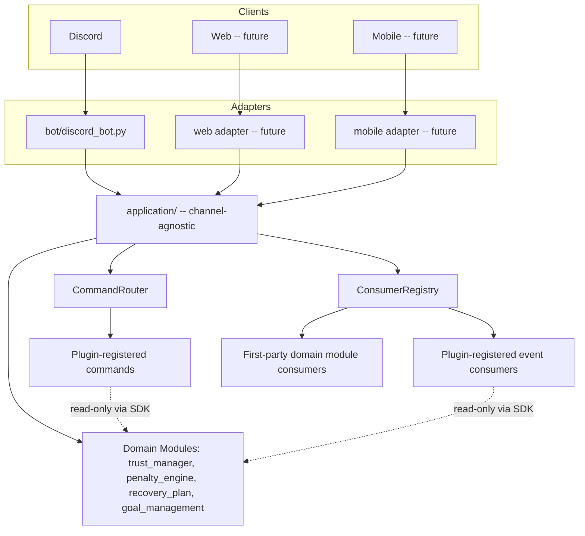
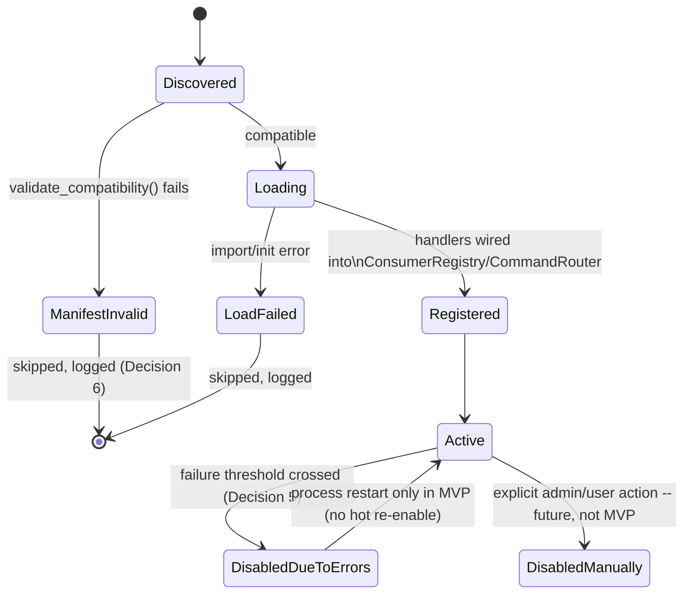

# Plugin Architecture — Architectural Proposal (v1.5)

> **Status: Draft architectural proposal — NOT approved for
> implementation.** No code implemented or modified. This document
> covers cross-cutting infrastructure (registry, event bus, DI,
> permissions, config, migrations, fault isolation) that will shape how
> Memory System, a future Relationship/Decision Engine, and any future
> client (web, mobile) all eventually connect — resolved once, here,
> deliberately before more first-party code accumulates around
> whatever pattern happens to exist today.
>
> Depends on `implementation_conventions.md` (the Interpretation
> Handoff Pattern this whole document generalizes one layer further),
> `application/README.md` (Phase 3.1's adapter/application-layer
> boundary, which this document extends rather than replaces), and
> `memory_system_technical_design.md` v1.4 (the most recent precedent
> for this project's own review discipline — capability matrices,
> explicit ownership tables, numbered invariants).
>
> **v1.1 (small consistency patch, no architectural direction
> changed):** added Decision 9/PLUG-9 — plugin-to-plugin dependencies
> are explicitly not supported in the MVP (no `depends_on_plugins`/
> `optional_plugins`/`conflicts_with`/`load_after`), stated as a
> deliberate exclusion rather than left as a silent absence, so the
> question doesn't get answered piecemeal, one ad hoc field at a time,
> before a second and third real plugin exist to inform what shape
> dependencies actually need. Also added one explicit sentence to
> Section 13: a plugin migration must never alter or rename a table
> owned by another plugin or any domain module — the direct consequence
> of the ownership rule already stated there, worth saying outright.
>
> **v1.2 (implementation-alignment patch — corrects wording against
> what Step 1 actually built, `infrastructure/plugin_fault_boundary.py`;
> no architectural direction changed):** PLUG-7's own text, Section 12,
> Section 15's testing strategy, Risk 9, and Open Question 4 all
> described a "timeout" that "fires" when a handler "hangs" — language
> this document itself never should have used, since Step 1's actual
> implementation found (and documented, in
> `infrastructure/README.md`) that a true hard timeout against a
> synchronous handler touching the shared `sqlite3` connection is
> unsafe to build via the obvious thread-with-join-timeout approach.
> What v1.1 called "timeout"/`timeout_seconds`/`exceeded_timeout` is now
> named for what it actually is: an **execution budget** — every call
> is measured, and one exceeding the budget is logged and counted
> toward the failure threshold once it *returns*, but nothing is ever
> interrupted, and a genuinely hung handler is not protected against.
> Section 15's testing strategy no longer promises a test for
> "a hanging handler proves the timeout fires" — no safe test can prove
> that, since nothing enforces it. A true hard timeout remains real,
> deferred, future work (Open Question 4).
>
> **v1.3 (Step 2 complete — `infrastructure/plugin_registry.py` —
> plus one small addendum; no architectural direction changed):** two
> real findings surfaced while implementing `PluginRegistry`, both
> resolved consistently with this document's own existing rules:
> (1) `PluginSDK` originally stored `core` as `self._core` — trivially
> reachable as `sdk._core` despite Python's underscore convention,
> silently defeating PLUG-1/PLUG-5 for any plugin, deliberate or not.
> Fixed by binding `publish_event` as a closure over `core` instead —
> `core` now lives only in that closure's own cell, not as a
> discoverable attribute. Section 18 gained a new addendum recording
> the concrete reason this belongs there: this fix raises the bar
> sharply but is not literally unbreakable (`__closure__` introspection
> still exists), which is exactly why any future third-party design
> cannot rely on Python-level encapsulation as its actual security
> boundary. (2) `ConsumerRegistry.dispatch()`'s own loop had no
> exception boundary at all (Section 1's own original finding) — fixed
> as part of wiring plugin event consumers through it, since PLUG-6
> cannot be true for plugins without it: a plugin handler's own
> `PluginFaultBoundary` tracks failures and re-raises (rather than
> swallowing) specifically so `consume_event()`'s transaction still
> rolls back correctly, and `dispatch()`'s new per-registration
> try/except is what stops that re-raised failure from aborting every
> other registration for the same event — benefiting first-party
> consumers too, not only plugins. See `infrastructure/README.md` for
> the full account of both.
>
> **v1.4 (tightens PLUG-2 — no architectural direction changed):** a
> review question caught that `publish_event()`/
> `publish_event_in_transaction()` only checked an event's namespace
> prefix (`plugin_<name>.*`), not membership in the plugin's own
> declared `publishes_event_types` — meaning a plugin could publish
> any event under its own namespace, not only the specific ones it
> declared upfront. `publishes_event_types` is now a binding allowlist,
> exactly the same "declare it or you can't reach it" discipline
> PLUG-5 already applies to read capabilities — being correctly
> namespaced is necessary but no longer sufficient on its own.
>
> **v1.5 (records a decided direction for Open Question 6 — the
> transaction-aware SDK read gap found in Step 3 — no code changed
> here):** resolved which shape the fix should take
> (Section 26, Question 6): explicit `_in_transaction`-suffixed read
> method variants for event consumer handlers, mirroring
> `publish_event`/`publish_event_in_transaction` exactly, deliberately
> not a single method that silently branches on whether a transaction
> happens to already be open. Implementation is its own, separate,
> future infrastructure step (Section 27) — not a blocker for anything
> already shipped through Step 3.

## 1. Survey — What Already Functions as an Extension Point

The instruction to not build a second parallel abstraction requires
knowing, precisely, what already exists. It is more than it might
appear:

| Already exists | Where | What it already does | Role in this proposal |
|---|---|---|---|
| `ConsumerRegistry.register(event_type, consumer_name, handler)` | `infrastructure/consumer_registry.py` | A working event bus: register a handler for an event type, dispatch by type, per-consumer transactional isolation and dedup | **Reused as-is** as the plugin event bus — Section 6 |
| `CommandRouter.register(command, description, handler)` | `application/router.py` | A working, minimal command registry | **Reused as-is** as the plugin command registry — Section 4 |
| `build_consumer_registry()` | `system/startup.py` | Today's (hardcoded, first-party-only) registration/wiring step at startup | **Generalized**, not replaced — Section 4 |
| Domain module shape (`models.py` + `repository.py` + `README.md`, narrow public read API, private `_*_in_transaction`) | `trust_manager/`, `penalty_engine/`, `recovery_plan/`, `goal_management/` | The module boundary itself | A plugin follows this **same shape** for anything it owns — Section 2 |
| `TestGoalStructuralIsolation` (import-boundary test) | `tests/goal_management/test_repository.py` | An automated, enforced check that one module never imports another's internals | **Generalized** into the plugin capability-enforcement mechanism — Section 8 |
| `BOOTSTRAP_DEFAULT` tag + its own guard test | `trust_manager/`, `penalty_engine/`, `tests/test_bootstrap_default_tags.py` | Flag-undecided-things-with-an-automated-format-check pattern | Precedent for how plugin manifests are validated — Section 4 |
| Migration numbering + non-destructive rule | `database/migrations/`, its own `README.md` | Schema ownership and versioning | A plugin's own migrations **follow the same rule**, in their own numbered sequence — Section 13 |
| `application/` boundary (`IncomingMessage`/`OutgoingMessage`, no `discord` import) | `application/README.md` | The adapter/client boundary already established for Discord, designed to admit a second adapter without touching `application/` | **This is already Client/Adapter's definition** — Section 2 formalizes what Phase 3.1 already built |
| Constructor-based DI (`TrustManager(db_path, core=core)`, no framework) | every module's `__init__` | Simple, explicit, manual dependency injection | **The DI style this document keeps** — Section 5, no framework introduced |
| Simple `try/except` + safe-fallback pattern | `bot/discord_bot.py`, `application/service.py` | Best-effort error handling that never crashes the caller | Extended, not replaced — Section 12 |

**A real, concrete gap found during this survey, not theorized:**
`ConsumerRegistry.dispatch()` gives every consumer its own transaction
(one consumer's rollback never affects another's), but has **no
exception boundary at all** — an unhandled exception from one
consumer's handler propagates straight through `dispatch()` and
`process_pending_events()`, capable of crashing the whole
`on_system_startup()` call today. This is not a plugin problem yet —
no plugin exists — but it is the exact gap Section 12's fault-isolation
design must close, and closing it for plugin-registered handlers
specifically (this document's scope) would be a natural, minimal step
toward closing it for first-party consumers too (out of this
document's scope at v1.0, but flagged as a related, pre-existing
finding — Section 25's risks; **resolved in Step 2 for both**, see
Section 25 Risk 1's own updated status and
`infrastructure/README.md`).

## 2. Definitions and Boundaries

Four distinct concepts, frequently conflated in systems like this one:

- **Domain Module** — first-party, always present, owns a slice of
  core business state (`trust_manager`, `penalty_engine`,
  `recovery_plan`, `goal_management`, and — once built —
  `relationship_engine`/`decision_engine`/`memory_system`). Never
  dynamically loaded; imported directly, shipped as part of the core
  codebase. **A domain module is never a plugin** and this document
  does not change how domain modules work.
- **Plugin** — an optional, independently loadable and unloadable unit
  that *extends* the system by consuming events, registering commands,
  and/or owning its own narrow, plugin-scoped tables. A plugin never
  becomes a second source of truth for anything a domain module already
  owns (Section 8) and never introduces a core business rule other
  domain modules depend on. **Graduation, not permanence:** if
  something built as a plugin turns out to be foundational — the same
  way Goal Management was always meant to be a real domain module, not
  a plugin — it should graduate into a first-party domain module
  through the same review process any other core module would go
  through, not remain a "plugin" indefinitely once it stops behaving
  like an optional extension.
- **Adapter** — a thin, channel-specific translation layer converting a
  client's native format to/from `application/`'s channel-agnostic
  `IncomingMessage`/`OutgoingMessage`. `bot/discord_bot.py` is the only
  one that exists. **An adapter is not a plugin** — it is not optional
  or dynamically loaded; it is the literal entry point of one specific
  client.
- **Client** — the actual external surface (Discord today; web/mobile
  later), realized through exactly one Adapter each. Not code in
  itself — the product surface the Adapter represents.



## 3. Explicit Decisions

**1. What a plugin may and may not do directly.**
May: read any domain module's existing public API; register event
consumers and commands (Sections 4/6); own and migrate its own tables
(Section 13); publish events in its own namespace. May not: write to
any domain module's tables; call any `_*_in_transaction` method; write
to another plugin's tables; fabricate or alter a `Decision`
(`relationship_decision_engine_technical_design.md`) or a Communication
Layer identity's output (`ai_identity_technical_design.md` ID-1..ID-8);
import any domain module's internals directly (only the curated SDK,
Section 8).

**2. May a plugin write to foreign domain tables?** No — same rule this
entire project already applies to every module (`MEM-1` in
`memory_system_technical_design.md`, GOAL-1 in `goal_management`, and
now generalized here as **PLUG-1**).

**3. Who owns plugin configuration and migrations?** The plugin itself,
exclusively. Its own config namespace (Section 9), its own numbered
migration sequence under its own directory (Section 13) — never
interleaved with `database/migrations/001..011`, never referencing a
plugin's tables from a domain module's schema or another plugin's.

**4. How is bypassing Decision Engine/Trust Manager/Memory
System/personality prevented?** Structurally, not by convention alone
(Section 8): a plugin can only import a deliberately narrow
`plugin_sdk` package — never `trust_manager`, `relationship_decision_engine`,
`memory_system`, or `ai_identity`'s own internals directly. The SDK
exposes read functions only, gated by the plugin's own declared
capabilities (Section 4's manifest). An automated import-boundary test
(generalizing `TestGoalStructuralIsolation`) runs against every
registered plugin. A plugin may send its own simple, non-decision
messages (e.g. "reminder: X") directly, but can never construct
something shaped like a `Decision` and pass it through the
Communication Layer as if the real Decision Engine produced it — this
is a distinction about forging authority, not about routing every
plugin message through a heavyweight pipeline it doesn't need.

**5. How does a plugin get deactivated on error, without crashing the
app?** A **PluginFaultBoundary** wraps every plugin-registered handler
invocation (event consumer or command) in its own exception boundary —
closing Section 1's real, pre-existing gap, scoped here to
plugin-registered handlers. A simple failure-count threshold within a
time window (a `BOOTSTRAP_DEFAULT`-tagged constant, owner undecided)
auto-transitions a plugin's status to `disabled_due_to_errors` — a
recorded, logged, never-silent transition (Section 14), not a crash and
not a silent no-op.

**6. How is compatibility verified before loading?** Every plugin
manifest declares the plugin-API version it targets and the core
system version range it's compatible with (Section 10). At startup,
before a plugin's code is even imported, the manifest is validated
against the running core version; an incompatible plugin is skipped
(never loaded), logged clearly, and the system continues without it —
fault isolation extends to load time, not only runtime.

**7. What capabilities must a plugin declare upfront?** Its full
manifest (Section 4): name, version, targeted plugin-API version,
requested read capabilities (which domain modules' SDK surface it
needs), event types it consumes, event types it publishes (in its own
namespace only), commands it registers, whether it owns tables (and how
many migrations), its trust tier (Decision 8), and its config keys.

**8. First-party trusted plugins versus future third-party plugins.**
First-party: shipped in this repository, reviewed the same as any other
code, loaded automatically, may be granted broader read capabilities
where genuinely justified. Third-party: **not designed here at all** —
sandboxing, distribution, and narrower default grants are all real,
substantial questions this document deliberately defers, reserving only
a `trust_tier: 'first_party' | 'third_party'` field in the manifest now
so the shape doesn't need to change later, the same reservation pattern
`memory_system_technical_design.md`'s `UserAuthorizedAction.actor` used
for a field with exactly one legal value today.

**9. Plugin-to-plugin dependencies (added v1.1).** **Not supported in
the MVP** — a deliberate exclusion, not an oversight. `PluginManifest`
has no `depends_on_plugins`, `optional_plugins`, `conflicts_with`, or
`load_after` field at all (Section 4). Every plugin is loaded
independently and must not assume any other plugin exists, is loaded,
or is loaded in any particular order relative to it. **Reasoning:**
with exactly one example plugin (Section 20), there is no real
dependency pattern yet to generalize from — the same "abstract after it
repeats, not before" discipline Section 21 already applies to this
whole document's own migration plan. Adding dependency-expressing
fields now, before a second and third plugin reveal what shape those
dependencies actually need (ordering only? version-range constraints?
soft "works better together" hints versus hard requirements?), would
be exactly the kind of speculative generalization this project has
consistently avoided elsewhere. This decision is deliberately explicit,
not merely an absence, specifically to prevent dependency-like fields
from being added ad hoc, one at a time, without ever revisiting the
question as a whole once real plugins exist to inform it. **PLUG-9:**
`PluginRegistry` loads plugins in a fixed, deterministic order
(alphabetical by name, in the MVP) with no dependency resolution step —
any plugin that requires another plugin to already be active is, by
definition, not something the MVP supports building yet.

## 4. Registry and Discovery

**No new event bus or command router is introduced.** A `PluginRegistry`
is a thin coordination layer: at startup, it discovers plugins (MVP:
static — scans a fixed `plugins/` directory, Section 19), validates
each manifest (Decision 6), and — for each plugin that passes
validation — calls the *existing* `ConsumerRegistry.register()` and
`CommandRouter.register()` for whatever the manifest declares,
wrapping each handler in a `PluginFaultBoundary` (Section 12) before
registering it. `ConsumerRegistry`/`CommandRouter` themselves gain one
small, additive change: a `source: 'domain_module' | 'plugin'` tag per
registration, for audit (Section 14) — everything else about them is
unchanged.

```python
@dataclass(frozen=True, kw_only=True)
class PluginManifest:
    # Deliberately NO depends_on_plugins/optional_plugins/
    # conflicts_with/load_after field (Decision 9/PLUG-9, v1.1) --
    # plugin-to-plugin dependencies are out of scope for the MVP.
    name: str
    version: str
    plugin_api_version: str
    min_core_version: str
    max_core_version: str | None
    trust_tier: Literal['first_party', 'third_party']  # only 'first_party' usable today
    requested_read_capabilities: tuple[str, ...]         # e.g. ('goal_management.read', 'trust_manager.read')
    consumes_event_types: tuple[str, ...]
    publishes_event_types: tuple[str, ...]                # must all be namespaced 'plugin_<name>.*'
    registers_commands: tuple[str, ...]
    owns_tables: bool
    config_keys: tuple[str, ...]

class PluginRegistry:
    def discover(self) -> list[PluginManifest]: ...
    def validate_compatibility(self, manifest: PluginManifest, *, core_version: str) -> bool: ...
    def load(self, manifest: PluginManifest, *, consumer_registry: ConsumerRegistry, command_router: CommandRouter, sdk: PluginSDK) -> LoadedPlugin | PluginLoadFailure: ...
```

## 5. Lifecycle



No hot-reload in the MVP (Section 18) — a plugin's lifecycle is bound to
the process's own lifecycle; disabling due to errors is a runtime status
flag (handlers stop being invoked), not an unload.

## 6. Dependency Injection

**No DI framework introduced** — this project has never used one, and
the existing constructor-injection style (`TrustManager(db_path,
core=core)`) already works. A plugin's `__init__` receives exactly
`(sdk: PluginSDK, core: Database)` if it owns tables, or just `(sdk:
PluginSDK)` if it doesn't — nothing else. This is deliberately smaller
than what a domain module receives (never a raw `core` reference unless
it owns tables, and never any other domain module's repository object
directly — only through the SDK).

## 7. Event Bus and Event Types

Reuses `ConsumerRegistry`/the transactional outbox exactly as built
(Section 1). Two additive rules for plugins specifically:

- **PLUG-2 (tightened — see the version header):** A plugin may only
  publish an event whose type is *literally listed* in its own
  manifest's `publishes_event_types` — the same "declare it or you
  can't reach it" discipline PLUG-5 already applies to read
  capabilities, not merely a namespace check. Being correctly
  namespaced (`plugin_<name>.<event>`) is necessary but not sufficient
  on its own: a plugin that declared `publishes_event_types=('plugin_x.a',)`
  cannot publish `plugin_x.b` just because it shares the right prefix.
  Enforced the same way `source_module` is already recorded on every
  `DomainEvent` today; a plugin publishing `goal.completed`
  (impersonating Goal Management), or any event type it did not
  specifically declare, is rejected at the SDK's publish function, not
  merely discouraged by convention.
- **PLUG-3:** A plugin may consume any event type it declares in its
  manifest (Decision 7) — no restriction on which *domain* events a
  plugin may react to, since reacting is read-only and already governed
  by PLUG-1. The restriction is entirely on the *write*/*publish* side.

## 8. Permission / Capability Model

The actual enforcement mechanism, generalizing `TestGoalStructuralIsolation`:

- **PLUG-4 (structural):** a plugin's source code may only `import
  plugin_sdk` for anything beyond the Python standard library and
  explicitly whitelisted third-party packages — never `trust_manager`,
  `penalty_engine`, `recovery_plan`, `goal_management`,
  `relationship_decision_engine`, `memory_system`, or `ai_identity`
  directly. Checked by an automated test run against every registered
  plugin's source (the same import-line-scanning technique
  `TestGoalStructuralIsolation` already uses), not merely documented as
  a rule.
- **PLUG-5 (declared, checked at load):** `PluginSDK`'s read functions
  for a given domain module are only actually callable if the plugin's
  manifest declared the corresponding `requested_read_capabilities`
  entry — an undeclared capability isn't merely discouraged, the SDK
  object handed to that plugin simply doesn't expose the function at
  all (built per-plugin from its own manifest, not a single shared
  object every plugin receives identically).

```python
class PluginSDK:
    """Constructed fresh per plugin, exposing only what that plugin's
    manifest actually declared (PLUG-5) -- never a shared, fully-loaded
    object every plugin receives identically."""
    # e.g., present only if 'goal_management.read' was declared:
    # def get_goal(self, goal_group_id: str) -> Goal | None: ...
    def publish_event(self, event_type: str, payload: dict, *, now: datetime) -> None:
        """PLUG-2: raises unless event_type is literally listed in
        this plugin's own manifest.publishes_event_types -- a binding
        allowlist, not only a 'plugin_<name>.' namespace check."""
```

## 9. Configuration and Secrets

Builds on `core/config.py`'s existing `.env` loader, not a replacement.
Each plugin's config keys (declared in its manifest) are namespaced —
`PLUGIN_<NAME>_<KEY>` — and resolved through the same minimal loader
Phase 0 already built. A plugin never reads `os.environ` or `.env`
directly; it receives only its own declared, namespaced values via the
SDK (`sdk.get_config(key)`), which raises for any key not in its own
manifest's `config_keys` — the same "declare it or you can't reach it"
discipline as Section 8's read capabilities.

## 10. API and Schema Versioning

Two independent version axes, not one:

- **Plugin API version** (the `PluginSDK`'s own shape/contract) — bumped
  whenever the SDK's surface changes in a way that could break an
  existing plugin. A plugin declares the version it targets
  (`plugin_api_version`); Decision 6's compatibility check compares
  this against what the running core actually provides.
- **Plugin's own data schema version** — each plugin's own migrations
  (Section 13), entirely independent of the plugin API version and of
  core's own `database/migrations/001..011` sequence.

## 11. Compatibility and Deprecation Policy

- A `PluginSDK` function is never removed within the same major plugin
  API version — only deprecated (documented, still callable, logged
  once per plugin per process start if used) and removed only at the
  next major version bump, with a minimum notice period (a
  `BOOTSTRAP_DEFAULT`-tagged constant, not fixed here).
- `min_core_version`/`max_core_version` in the manifest let a plugin
  express "I don't yet support this newer core version" without that
  being treated as a bug — an honest compatibility boundary, not a
  failure.

## 12. Fault Isolation, Timeouts, and Circuit Breaking

**PLUG-6:** Every plugin-registered handler invocation — event consumer
or command — runs inside a `PluginFaultBoundary`: a try/except that
catches any exception, logs it with the plugin's name and the
triggering event/command, and returns a safe no-op result instead of
propagating — closing Section 1's real gap for plugin-registered
handlers specifically (first-party domain consumers are unaffected by
this document; that same gap for them is flagged as a related risk,
Section 25, not fixed here).

**PLUG-7 (corrected wording, v1.2 — see the version header):** Every
plugin handler invocation is measured against an **execution budget**
(a `BOOTSTRAP_DEFAULT`-tagged constant) — a call whose duration exceeds
it is logged and counted toward the failure threshold once it returns,
the same as a raised exception would be. **This is not a hard
timeout.** The handler is never interrupted; a genuinely hung
(infinite-loop) synchronous handler will hang the call, and its
caller, indefinitely — an explicitly acknowledged, currently
unresolved limitation (Section 26, Open Question 4), not something the
MVP claims to solve. A true hard timeout would require a fully
asynchronous handler contract with cooperative cancellation, a
separate process, or another genuinely preemptible execution
boundary — deliberately out of scope here.

**Circuit breaking:** a rolling failure count within a time window
(both `BOOTSTRAP_DEFAULT`-tagged) — crossing the threshold transitions
the plugin to `disabled_due_to_errors` (Section 5); no partial
degradation model (e.g. "half-open" retry probing) is designed in the
MVP — that refinement is Section 18's future scope, not needed for a
first, working version of this boundary.

## 13. Migrations and Table Ownership

A plugin that owns tables gets its own migration directory
(`plugins/<name>/migrations/001_....sql`, Section 19), applied through
the *same* `Database.migrate()` machinery core already uses, but
tracked in its own `schema_version`-equivalent scope (a
`plugin_schema_versions` table, keyed by plugin name, mirroring the
core `schema_version` table's own shape) — never interleaved with
`database/migrations/001..011`'s own numbering. The same non-destructive
rule (`database/migrations/README.md`) applies without exception. **No
foreign key from any domain module's table into a plugin's table, and
none from one plugin into another's** — preserves the actual point of
being a plugin: removable without breaking anything that referenced it.
A plugin references a domain module's record the same way Memory System
does (`source_ref`-style, a stored identifier, never a hard FK) —
identical reasoning to `memory_system_technical_design.md` Section 6's
own note on this. **A plugin's migration must never alter or rename a
table owned by another plugin or by any domain module (added v1.1)** —
the direct, explicit consequence of the ownership rule stated above,
worth stating as its own sentence rather than left implicit.

## 14. Observability and Audit

Every plugin lifecycle transition (Section 5) and every handler
invocation's outcome (success, exception caught, timeout) is logged
with the plugin's name, structured enough to answer "which plugin did
what, when, and did it fail" after the fact — the same audit posture
this project already applies everywhere (`domain_events`,
`memory_audit_log`). A `plugin_registry.enable/disable` transition is
never silent, mirroring `philosophy.md` 2.5's standing rule that the
system doesn't quietly change its own operating state without a
recorded reason.

## 15. Testing Strategy

- **Manifest validation tests** — malformed/incompatible manifests are
  rejected, never loaded (unit-level, no real plugin needed).
- **Import-boundary tests** (PLUG-4) — run against every registered
  plugin's actual source, generalizing `TestGoalStructuralIsolation`.
- **Fault-boundary tests** — a deliberately-raising fake handler proves
  `PluginFaultBoundary` catches it, logs it, and does not propagate;
  a deliberately-*slow* (finite-duration) fake handler proves
  `slow_execution` is flagged and counted toward the failure threshold
  (PLUG-7, v1.2 wording). **Not tested, and cannot safely be:** a
  genuinely hanging (infinite-loop) handler actually being interrupted
  — no such mechanism exists (Section 26, Open Question 4), and a test
  attempting to exercise one would itself hang. This is the direct
  test-suite consequence of PLUG-7 being an execution budget, not a
  hard timeout, made explicit here rather than the testing strategy
  implicitly promising coverage that cannot exist.
- **Capability-gating tests** — a plugin manifest that doesn't declare
  a read capability genuinely cannot call the corresponding SDK
  function (an `AttributeError`/absence, not a runtime permission
  check that could be forgotten).
- **Example plugin's own test suite** (Section 17) as the end-to-end
  proof the whole lifecycle actually works together.

## 16. Security and the Prompt-Injection Boundary

A plugin is first-party, trusted code (Decision 8) — the concern here
is not a malicious plugin author, but a plugin that **handles untrusted
external content** (e.g. a future web-search plugin, a future
integration pulling in third-party data) and could inadvertently pass
injected instructions downstream. **PLUG-8:** any content a plugin
publishes into an event payload, or hands to the Communication Layer
for phrasing, is treated exactly as external content per
`memory_system_technical_design.md` 3.11's own rule — labeled data,
never concatenated as if it were an instruction, and subject to the
same storage-time injection-pattern check if it ever becomes a
candidate Memory record. A plugin never gets a code path that skips
this — the SDK's publish/send functions apply it uniformly, not left to
each plugin author's own diligence.

## 17. Discord Today, Web/Mobile Later

Nothing in this document is Discord-specific — the entire Registry/
Event Bus/SDK/Fault Isolation design sits *below* `application/`, the
same channel-agnostic layer Phase 3.1 already built. A plugin's
registered command becomes reachable from any adapter that routes
through `CommandRouter`, and a plugin's registered event consumer reacts
identically regardless of which client triggered the originating event.
Building a second adapter (web, then mobile) requires no change to this
document's design at all — exactly the guarantee `application/README.md`
already made for Phase 3.1's own boundary, now confirmed to extend
cleanly one layer further.

## 18. MVP Variant vs. Future Variant

**MVP:**
- First-party plugins only; static discovery (scan a fixed directory
  at startup); no hot-reload.
- Manifest as a plain Python dataclass (Section 4), not a separate JSON
  schema or external format.
- Simple failure-count circuit breaking; no half-open/retry probing.
- No sandboxing — first-party code is trusted the same way a domain
  module is.
- **No plugin-to-plugin dependencies** (Decision 9/PLUG-9) — fixed,
  deterministic load order, no dependency resolution.

**Future (explicitly not designed here):**
- Third-party plugin support: sandboxing, distribution, narrower
  default grants, likely out-of-process execution for real isolation.
  **Concrete motivation, found during Step 1's implementation (v1.2
  addendum):** `PluginSDK`'s v1.2 fix (binding `publish_event` as a
  closure over `core` rather than storing `core` as a reachable
  attribute — `infrastructure/plugin_sdk.py`) raises the bar against
  *casual* or *accidental* access to the raw database far above the
  original `self._core` design, but does not make it unreachable in
  principle — Python still permits inspecting a closure's captured
  cells directly (`sdk.publish_event.__closure__`). That gap is
  acceptable for first-party plugins (reviewed code, PLUG-4's automated
  import-boundary test catches deliberate misuse) but would not be
  acceptable for arbitrary third-party code: **Python language-level
  encapsulation is not considered a security boundary**, and any future
  third-party plugin design must assume a sufficiently determined
  plugin can defeat anything enforced only by naming convention or
  closure scoping — real isolation for that case needs a boundary
  Python's own object model cannot be introspected across (a separate
  process, a genuine capability-security mechanism, or equivalent).
- Hot-reload / dynamic install without a restart.
- **A plugin dependency graph** (`depends_on_plugins`,
  `load_after`, `optional_plugins`, `conflicts_with`) — deliberately
  deferred until a second and third real plugin exist to reveal what
  shape it actually needs (Decision 9).
- Fine-grained, runtime-revocable per-capability permissions (a
  mobile-OS-style prompt model).
- A richer circuit breaker (half-open retries, gradual re-enablement).

## 19. Directory Structure

```
plugins/
    __init__.py
    <plugin_name>/
        __init__.py
        manifest.py       # PluginManifest instance
        models.py          # only if owns_tables=True
        repository.py       # only if owns_tables=True
        handlers.py          # event consumer + command handlers
        migrations/            # only if owns_tables=True
            001_....sql
        README.md
infrastructure/
    plugin_registry.py    # PluginRegistry: discover/validate/load
    plugin_sdk.py           # PluginSDK: the curated, per-plugin surface
    plugin_fault_boundary.py # PLUG-6/PLUG-7
tests/
    plugins/
        test_plugin_registry.py
        test_plugin_sdk_capability_gating.py
        test_plugin_fault_boundary.py
        <plugin_name>/
            test_<plugin_name>.py
```

## 20. Example Plugin: `goal_celebration`

Grounded in a real, already-published event (`goal.completed`,
`goal_management`) rather than a hypothetical one:

- **Manifest:** `requested_read_capabilities=('goal_management.read',)`,
  `consumes_event_types=('goal.completed',)`,
  `publishes_event_types=('plugin_goal_celebration.sent',)`,
  `owns_tables=True`.
- **Its own table**, `goal_celebration_log(goal_group_id, celebrated_at)`
  — exists purely for idempotency (has this specific Goal already been
  celebrated), the same reasoning every domain module in this project
  already applies to its own dedup concerns.
- **Handler:** on `goal.completed`, reads the Goal via
  `sdk.get_goal(goal_group_id)` (its one declared capability), checks
  its own `goal_celebration_log` for an existing row, and — if none —
  sends a small, simple congratulatory message directly (not a
  `Decision`; Decision 4's "no forged authority" rule is satisfied
  because this is explicitly *not* claiming to be a system decision,
  just a plugin-authored, clearly-scoped celebration message) and
  writes its own log row.
- Demonstrates: read-only domain access via SDK, event consumption,
  owning a table for its own purposes only, publishing its own
  namespaced event, and never touching `goal_management`'s own tables.

## 21. Migration Plan From the Current Architecture

1. Build `plugin_sdk.py`/`plugin_registry.py`/`plugin_fault_boundary.py`
   with **zero plugins yet** — proves the infrastructure against the
   `goal_celebration` example plugin alone.
2. Add the `source: 'domain_module' | 'plugin'` tag to
   `ConsumerRegistry`/`CommandRouter` registrations (additive, does not
   change existing first-party wiring in `system/startup.py`).
3. Land `goal_celebration` as the first real plugin, exercising the
   full lifecycle end-to-end.
4. Only after a second, genuinely different plugin exists should any
   part of this design be revisited for generalization — the same
   "abstract after it repeats, not before" discipline this project has
   followed throughout (Recovery Credit only existed after Recovery
   Plan; the Relationship Engine's Domain State reads only after four
   real domain modules existed to read from).

## 22. Architectural Invariants

| ID | Statement |
|---|---|
| PLUG-1 | A plugin never writes to any domain module's tables or another plugin's tables |
| PLUG-2 | A plugin may only publish an event type literally listed in its own manifest's `publishes_event_types` — a binding allowlist, not merely a `plugin_<name>.*` namespace check |
| PLUG-3 | A plugin may consume any event type it declares; the restriction is on publishing, not consuming |
| PLUG-4 | A plugin's source may only import `plugin_sdk`, stdlib, and whitelisted packages — checked by an automated import-boundary test against every registered plugin |
| PLUG-5 | A plugin's `PluginSDK` instance only exposes what its own manifest declared — an undeclared capability isn't callable, not merely discouraged |
| PLUG-6 | Every plugin handler invocation runs inside a `PluginFaultBoundary` — an exception is caught, logged, and never propagates to the caller |
| PLUG-7 | Every plugin handler invocation is measured against an execution budget (v1.2 wording) — a call exceeding it is logged and counted as a failure once it returns; the handler is never interrupted, and a genuinely hung handler is not protected against (Section 26, Open Question 4) |
| PLUG-8 | Content a plugin publishes or sends is treated as untrusted external content (labeled data, never an instruction), uniformly, via the SDK — never left to per-plugin discipline |
| PLUG-9 | No plugin-to-plugin dependencies in the MVP — `PluginRegistry` loads every plugin independently, in a fixed deterministic order, with no dependency resolution; a plugin must never assume another plugin exists or is loaded |

## 23. Ownership / Source-of-Truth Table

| Category | Authoritative source | Owner | Plugin may read? | Plugin may write? |
|---|---|---|---|---|
| Any domain module's own state | that domain module | that domain module | Yes, via SDK, if declared (PLUG-5) | **No** (PLUG-1) |
| Plugin manifest | the plugin's own `manifest.py` | the plugin author | N/A | N/A — declared once, validated at load |
| Plugin's own tables | the plugin itself | the plugin itself | N/A (it's the plugin's own data) | Yes — exclusively its own |
| `PluginSDK` surface/contract | `plugin_sdk.py` (core) | core (this document's own infrastructure) | N/A | **No** — a plugin cannot extend its own granted capabilities at runtime |
| Plugin lifecycle status (`active`/`disabled_due_to_errors`) | `PluginRegistry` | core | Read-only, if ever exposed to a plugin at all (not required by this document) | **No** — a plugin cannot re-enable itself |

## 24. Capability Matrix

| Capability | First-party Plugin (MVP) | Third-party Plugin (future, not designed here) |
|---|---|---|
| Register event consumer | Yes, for declared event types | Undecided |
| Register command | Yes | Undecided |
| Own database tables | Yes, own migrations | Undecided — likely no, or heavily restricted |
| Read domain module state | Yes, via SDK, if declared | Undecided — likely a much narrower default |
| Publish namespaced events | Yes | Undecided |
| Loaded automatically at startup | Yes | No — explicit opt-in envisioned, not designed |
| Sandboxed execution | No — trusted the same as core code | Presumed necessary, not designed |
| Hot-reload / runtime install | No (MVP) | No (future scope, not designed) |

## 25. Top 10 Risks

1. ~~The pre-existing `ConsumerRegistry.dispatch()` exception gap~~
   **resolved in Step 2**, and for every consumer (first-party
   included), not only plugin-registered handlers — see
   `infrastructure/README.md`'s Step 2 section for the full account,
   including why the fix had to preserve transactional rollback
   correctness (a plugin's handler wrapper re-raises rather than
   swallowing, specifically so `consume_event()`'s own transaction
   still rolls back before `dispatch()`'s new boundary catches it one
   level up).
2. **Manifest capability declarations could drift from actual SDK
   usage** if a future SDK change isn't mirrored by re-validating every
   existing plugin's manifest — no automatic mechanism proposed here
   to detect that drift proactively.
3. **`BOOTSTRAP_DEFAULT` calibration values** (failure threshold,
   timeout duration, deprecation notice period) are placeholders,
   unmeasured against real plugin behavior.
4. **A plugin's own migrations could still create a naming collision**
   with another plugin's tables if two plugin authors pick the same
   table name — no central table-name registry is proposed.
5. **Fault isolation doesn't distinguish "plugin bug" from "transient
   infrastructure failure"** (e.g. a DB lock timeout) — both count
   identically toward the circuit breaker in the MVP, which could
   disable a healthy plugin during an unrelated outage.
6. **The example plugin (`goal_celebration`) is deliberately simple** —
   a plugin with more complex cross-event state might strain the
   "own narrow tables, `source_ref`-only reference" model in ways not
   yet tested.
7. **No plugin currently exists**, so every part of this design is
   unvalidated against real usage — consistent with this project's own
   stated preference (Section 21) for validating after a second real
   plugin exists, but a real risk until then.
8. **Third-party plugins are explicitly out of scope**, but the
   `trust_tier` field's mere presence in the manifest could create
   pressure to build third-party support before it's actually
   designed, simply because the field exists.
9. **A true hard timeout for a synchronous handler** (most of this
   codebase today) remains unimplemented (v1.2: the MVP mechanism is
   now specified — an execution budget, measured after the fact, never
   interrupting the handler — but a genuine hard timeout would need a
   concrete mechanism this document still does not specify, e.g. a
   fully asynchronous handler contract with cooperative cancellation,
   or a separate process). A genuinely hung handler is not currently
   protected against at all.
10. **Plugin config keys and domain module config keys share the same
    underlying `.env` file** — a naming collision between a plugin's
    namespaced key and a future core config key is possible if the
    `PLUGIN_` prefix convention isn't consistently enforced.

## 26. Open Questions

1. Exact values for every `BOOTSTRAP_DEFAULT`-tagged constant in this
   document (failure threshold, timeout duration, deprecation notice
   period) — deferred to implementation, per this project's own
   standing convention.
2. ~~Whether `plugin_schema_versions` needs its own dedicated
   migration-tooling~~ **resolved in Step 3**: a dedicated
   `apply_plugin_migrations()` (`infrastructure/plugin_migrations.py`),
   deliberately not a namespaced call into `Database.migrate()` — kept
   as its own small function so plugin migrations never risk
   interacting with core's own `database/migrations/001..012`
   sequence or its backup step (Section 13 already noted plugin
   migrations skip a dedicated backup, relying on core's own).
3. Whether a plugin should ever be allowed to register a consumer for
   an event type that doesn't exist yet at load time (forward
   compatibility) or whether this should fail validation immediately —
   not decided.
4. **A true hard timeout** (as opposed to v1.2's execution budget,
   which is now implemented and specified) for a synchronous handler
   (Risk 9) — genuinely unresolved; the candidate mechanisms
   (cooperative async cancellation, a separate process) are named but
   not designed.
5. Whether first-party plugins eventually need their own individual
   `README.md`-documented rationale the way every domain module has
   (this document assumes yes, per Section 19's directory structure,
   but doesn't mandate a specific template).
6. **Transaction-aware SDK read methods (found during Step 3, v1.4 —
   direction decided, not yet implemented).** `PluginSDK`'s read
   capabilities delegate directly to each domain module's own public
   getter, which always opens its own transaction — safe from a
   command handler (no enclosing transaction), but an event consumer
   handler already runs *inside* `consume_event()`'s own transaction,
   so any such call raises `NestedTransactionError`. Found while
   writing `goal_celebration`'s handler (it avoids the problem
   entirely by not needing a domain read at all — see
   `plugins/goal_celebration/handlers.py`'s own docstring). **Decided
   direction, after review:** explicit, separate
   `_in_transaction`-suffixed variants for every read capability (e.g.
   `sdk.get_goal(goal_id)` for command handlers,
   `sdk.get_goal_in_transaction(tx, goal_id)` for event consumers) —
   the same explicit-context-in-the-name discipline
   `publish_event`/`publish_event_in_transaction` already established,
   deliberately *not* a single method that silently detects whether a
   transaction is already open and branches its own behavior
   accordingly (less explicit, and a much easier way to end up with
   surprising transactional behavior). Requires each domain module's
   own public getter to be split into a private, tx-only
   implementation both variants delegate to (so SQL and row-mapping
   are never duplicated) — a real, cross-cutting change touching all
   four domain modules' own repositories, not merely `plugin_sdk.py` —
   which is why this is recorded as its own future infrastructure
   step (Section 27) rather than implemented as part of Step 3.

## 27. Recommended Implementation Order

1. `plugin_sdk.py` + `plugin_fault_boundary.py`, tested in isolation
   with fake/synthetic handlers — no real plugin yet (Section 21, step 1).
2. `plugin_registry.py` (discovery, manifest validation, wiring into
   the *existing* `ConsumerRegistry`/`CommandRouter`).
3. The `source` tag addition to `ConsumerRegistry`/`CommandRouter`
   (small, additive, verifiable against existing first-party wiring
   continuing to work unchanged).
4. ~~The `goal_celebration` example plugin, end-to-end~~ **done** — the
   first real proof this design holds together outside of synthetic
   tests. Along the way: `apply_plugin_migrations()` (Open Question 2,
   now resolved), and the PLUG-2 allowlist tightening (v1.4).
5. **Next:** transaction-aware SDK read methods (Open Question 6) —
   splitting each domain module's public getters into a private,
   tx-only implementation plus public/`_in_transaction` wrappers, so an
   event consumer handler can safely read domain state without risking
   `NestedTransactionError`. Its own, separate infrastructure step, not
   a blocker for anything already shipped.
6. Only then: revisit this document itself for anything further
   implementation experience reveals as wrong, per this project's own
   consistent pattern of letting implementation experience, not further
   theorizing, drive the next revision.
